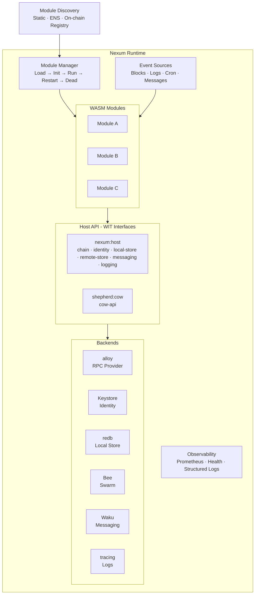
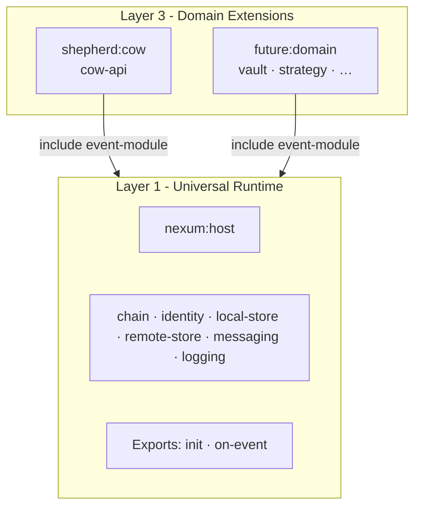
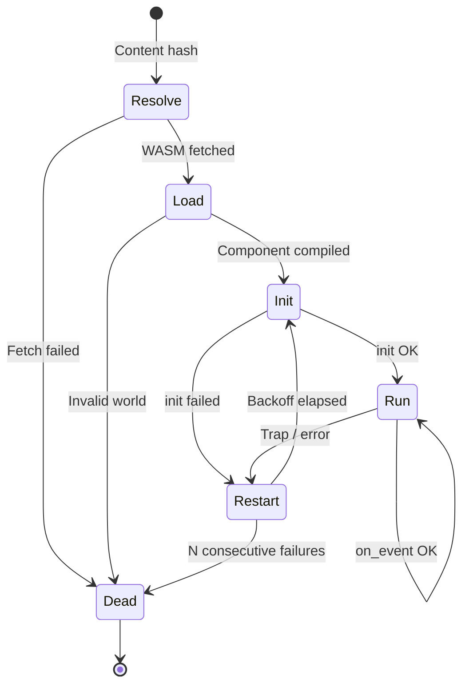

# Nexum: Universal WASM Component Model Runtime

Nexum is a WASM Component Model runtime that provides secure, sandboxed execution for WebAssembly modules. Modules react to blockchain events, read chain state, persist data locally and to decentralised storage, communicate via decentralised messaging - all within a capability-based sandbox with zero implicit permissions.

**Shepherd** is the Nexum distribution that includes CoW Protocol extensions (`shepherd:cow` WIT package). A module compiled against the universal `nexum:host/event-module` world runs on any Nexum-compatible host. A module compiled against `shepherd:cow/shepherd` additionally gains access to CoW Protocol APIs and order submission - and requires a Shepherd host.

### Vocabulary: engine vs. host (`nexum` vs. `nexum:host`)

Two project names look similar but mean different things - keeping them straight is load-bearing for everything that follows:

| Term | What it is | Where you find it |
|---|---|---|
| **engine** (`nexum`) | A concrete *implementation* that loads and runs WASM components. The 0.2 reference engine is a wasmtime-based server daemon. Mobile / browser / embedded engines could exist later - each is a separate engine. | `crates/nexum-runtime/`, the `nexum` binary, `cargo run -p nexum-cli` |
| **host** (`nexum:host`) | The WIT *contract* - the set of host-imported interfaces (chain, identity, local-store, etc.), types, and worlds that every engine must implement and every module imports. The contract is one; engines are many. | `wit/nexum-host/`, `package nexum:host@0.2.0`, Rust path `nexum::host::*` |

The relationship: an engine *implements* `nexum:host` so that modules *built against* `nexum:host` can run on it. The `nexum:host` package itself does not run anything - it's a specification. When this doc says "the host", it means whichever engine the module currently runs on, as seen through the `nexum:host` contract.

> **Upgrading from 0.1?** See the [Migration Guide](migration/0.1-to-0.2.md) for the full rename table (`web3:runtime` → `nexum:host`, `csn` → `chain`, `msg` → `messaging`, `headless-module` → `event-module`, etc.), the unified `host-error` model, and the manifest-driven capability negotiation introduced in 0.2.

## Architecture



## Design Principles

- **Component Model from day 1** - WIT-defined API contract; structural sandboxing (no WASI, no FS, no network); multi-language guests.
- **Declarative subscriptions** - modules declare events in their manifest; the runtime wires sources.
- **Transactional state** - per-event all-or-nothing semantics; commit on success, rollback on trap.
- **Content-addressed distribution** - modules are fetched by hash (Swarm, IPFS, OCI, HTTPS); integrity always verified.
- **Self-hosted** - no centralised dependency; operator runs their own node.

## The Six Primitives

Every module has access to six orthogonal capabilities through the `nexum:host` WIT package:

| Primitive | Interface | Purpose | Scope | Backend (Server) |
|-----------|-----------|---------|-------|-------------------|
| **Chain** | `chain` | Read/write blockchain state via JSON-RPC | Global (per chain) | alloy Provider |
| **Identity** | `identity` | Key management and message signing | Per-account | Keystore / KMS / HSM |
| **Local Store** | `local-store` | Per-module key-value persistence | Device-local, per-module | redb |
| **Remote Store** | `remote-store` | Decentralised content-addressed storage | Global (content-addressed) | Ethereum Swarm |
| **Messaging** | `messaging` | Decentralised pub/sub messaging | Topic-based | Waku |
| **Logging** | `logging` | Diagnostic output | Per-module | tracing |

These primitives are orthogonal:

- **Chain** is the source of truth - the blockchain consensus state. Modules read chain state and (indirectly) write to it via order submission or transactions.
- **Identity** is cryptographic identity - key management and signing. The `chain` host implementation depends on `identity` internally: signing RPC methods (`eth_sendTransaction`, `eth_accounts`, `eth_signTypedData_v4`, `personal_sign`) delegate to the identity backend. Modules can also import `identity` directly for raw signing operations.
- **Local Store** is the module's private scratchpad - fast, local, scoped to one module on one device. Does not replicate.
- **Remote Store** is shared persistent content - content-addressed, decentralised, survives independent of any device. Any module on any device can read what another module wrote.
- **Messaging** is real-time communication - ephemeral pub/sub messages between modules, devices, or users. Transient and topic-based.
- **Logging** is diagnostics - one-way output for debugging and monitoring. Not a data channel.

## Additive 0.2 Capabilities

In addition to the six core primitives, the 0.2 WIT introduces three optional capabilities that modules can declare in their manifest:

- **`clock`** - wall-clock (`now-ms`, UTC milliseconds since Unix epoch) and monotonic (`monotonic-ns`) time, replacing the 0.1 workaround of reading `block.timestamp` inside `on_block`.
- **`random`** - a CSPRNG (`fill(len)`), since 0.1 modules had no source of secure randomness at all.
- **`http`** - an allowlisted outbound HTTP client (`fetch(request)`), gated by a `[capabilities.http].allow` domain list. The host MUST enforce the allowlist. This replaces the 0.1 anti-pattern of tunnelling notifications through Waku.

0.2 also publishes (but does not yet host) the experimental **`query-module`** world for request/response modules (wallet rule evaluators, signature validators, pricing oracles). The WIT is stable enough to target with `MockHost` tests; production host support lands in 0.3. See the migration guide for the full WIT.

## WIT Worlds

The WIT is split into layered packages. The universal layer (`nexum:host`) provides blockchain-agnostic capabilities. Domain extensions (e.g. `shepherd:cow`) add protocol-specific interfaces.



```
// Universal layer - any platform, any blockchain app
package nexum:host@0.2.0

world event-module {
    import chain          - consensus access (JSON-RPC passthrough)
    import identity       - key management and message signing
    import local-store    - local key-value persistence
    import remote-store   - decentralised storage (Swarm)
    import messaging      - decentralised messaging (Waku)
    import logging        - log (trace/debug/info/warn/error)

    export init(config)   - called once on load
    export on_event(event) -  called per subscribed event (block, logs, tick, message)
}

// CoW Protocol extension
package shepherd:cow@0.2.0

world shepherd {
    include event-module
    import cow-api        - CoW Protocol REST API + order submission
}
```

The `event-module` world imports **six** interfaces - chain, identity, local-store, remote-store, messaging, logging. The 0.1 WIT framing claimed six primitives but only actually imported five; 0.2 brings `identity` into the world definition so the contract matches the documentation.

No WASI interfaces are imported. All I/O is mediated through host interfaces. The `chain` interface exposes a single generic `request` function (plus an additive `request-batch` in 0.2) - the SDK implements alloy's `Transport` trait on top of it, giving modules the full alloy `Provider` API (80+ methods) with zero WIT churn.

> Design rationale: [07-rpc-namespace-design.md](07-rpc-namespace-design.md) | Platform generalisation: [08-platform-generalisation.md](08-platform-generalisation.md)

-> Full WIT definition: [01-runtime-environment.md](01-runtime-environment.md)

## Technology Stack

| Concern | Choice | Version |
|---------|--------|---------|
| Language | Rust | 1.90+ |
| WASM runtime | wasmtime (Component Model) | 45.x |
| API contract | WIT (`nexum:host@0.2.0`, `shepherd:cow@0.2.0`) | - |
| Guest bindings | wit-bindgen | 0.57.x |
| Async | Tokio | - |
| Ethereum RPC | alloy | 1.5.x |
| Local store | redb | 3.1.x |
| Logging | tracing + tracing-subscriber | - |
| Metrics | metrics + metrics-exporter-prometheus | - |
| Deployment | Docker | - |
| License | AGPL-3.0 | - |

## Module Package

A module ships as a **bundle**: a manifest (`nexum.toml`) plus a compiled WASM component.

```toml
# module.toml
[module]
name = "twap-monitor"
version = "0.3.0"
component = "sha256:9f86d081…"  # content hash of module.wasm

[chains]
required = [42161]               # must have RPC for these chains

[capabilities]
required = ["chain", "local-store", "logging"]
optional = ["messaging", "remote-store"]

[[subscription]]
kind = "block"
chain_id = 42161

[config]
cow_api_url = "https://api.cow.fi/arbitrum"
slippage_bps = 50                # integers stay integers in 0.2
```

The manifest declares identity, chain requirements, event subscriptions, capability grants, and typed module config - everything the runtime needs to load and run the module. In 0.2, `[capabilities]` is the canonical place to declare what host primitives a module needs; the engine cross-checks the component's WIT imports against `required` + `optional` at boot (link-time) and refuses to instantiate a module that imports an undeclared capability. Omitting `[capabilities]` falls back to "all imports required" with a deprecation warning.

> Per-module resource caps (`[module.resources]`: `max_memory_bytes`, `max_fuel_per_event`, `max_state_bytes`) are **not in 0.2 scope** - the engine uses global defaults (`DEFAULT_FUEL_PER_EVENT = 1B`, `DEFAULT_MEMORY_LIMIT = 64 MiB`). Per-module overrides via the manifest are a future direction; today, an operator who needs different caps changes the global defaults at build time. The `optional` trap-stub fallback for absent host imports is also deferred to 0.3 - in 0.2, every linked import resolves to a real host function.

-> Full spec: [02-modules-events-packaging.md](02-modules-events-packaging.md)

## Module Discovery

Three layers, from simplest to most decentralised:

| Method | How it works |
|--------|-------------|
| **Static** | Operator points at a local manifest path |
| **ENS** | Module author sets ENS `contenthash` (ENSIP-7) to a Swarm/IPFS reference; runtime resolves and fetches |
| **On-chain registry** | Runtime watches contract events or ENS `TextChanged` events for module registrations |

All methods converge: resolve content reference -> fetch via content store -> verify hash -> load.

-> Full design: [03-module-discovery.md](03-module-discovery.md)

## Module Lifecycle



- **Resolve**: fetch WASM by content hash from Swarm/IPFS/OCI/local.
- **Load**: compile `Component`, validate WIT world, create `InstancePre`.
- **Init**: create `Store`, instantiate, call `init(config)`.
- **Run**: dispatch subscribed events to `on_event`. Each call gets a fuel budget.
- **Restart**: on crash - exponential backoff (1s -> 5min cap), fresh `Store`, state persists.
- **Dead**: after N consecutive failures (poison pill) - requires manual intervention.

-> Full lifecycle: [02-modules-events-packaging.md](02-modules-events-packaging.md)

## Event System

- **Sources**: `block` (new heads via `eth_subscribe`), `log` (filtered contract events), `cron` (schedule-based), `message` (Waku content topics).
- **Shared subscriptions**: one block subscription per chain, fanned out to all subscribed modules.
- **Dispatch**: concurrent across modules, sequential within a module (ordered delivery).
- **Declared in manifest**: `[[subscription]]` blocks - the runtime wires sources, not the module.

-> Full design: [02-modules-events-packaging.md](02-modules-events-packaging.md)

## Local Store

- **Backend**: redb (pure Rust, ACID, MVCC, crash-safe).
- **Isolation**: one database file per module; modules cannot access each other's state.
- **Transactions**: each `on_event` runs in an implicit write transaction - commit on success, rollback on failure.
- **Survives restarts**: state is external to WASM instance.
- **Size enforcement**: `max_state_bytes` from manifest, enforced host-side.
- **Prefix scanning**: `list-keys(prefix)` for namespaced key organisation.

-> Full design: [04-state-store.md](04-state-store.md)

## SDK

The 0.2 SDK ships as a single crate, `shepherd-sdk`, with `shepherd-sdk-test` providing the mock-host surface for unit tests. The longer-term direction - a separate universal `nexum-sdk` crate that `shepherd-sdk` re-exports - is documented as design intent in [05-sdk-design.md](05-sdk-design.md) and is not in 0.2 scope. See [ADR-0009](adr/0009-host-trait-surface.md) for the shipped host-trait seam that replaces the proc-macro design described in earlier drafts of doc 05.

| Crate | Provides |
|-------|----------|
| `shepherd-sdk` | `host::{ChainHost, LocalStoreHost, CowApiHost, LoggingHost, Host}` - per-capability traits + supertrait, the seam modules implement against |
| | `HostError` / `HostErrorKind` - unified host error type with `?` support |
| | `chain::{eth_call_params, parse_eth_call_result, decode_revert_hex}` - JSON-RPC plumbing helpers |
| | `cow::{order, composable, error}` - CoW Protocol bridging (`gpv2_to_order_data`, `PollOutcome`, `RetryAction`, `classify_api_error`) |
| | `prelude::*` - alloy primitives + cowprotocol order / signing / orderbook surface in one import |
| `shepherd-sdk-test` | `MockHost` + per-trait `MockChain` / `MockLocalStore` / `MockCowApi` / `MockLogging` for native-Rust strategy tests |

Future direction (not in 0.2): a `#[nexum::module]` / `#[shepherd::module]` proc macro that subsumes the `wit_bindgen::generate!` + `WitBindgenHost` adapter boilerplate, a typed `TypedState` / `Signer` / `Cow` API client, alloy `Provider` injection via `HostTransport`, and a separate `nexum-sdk` crate for non-CoW universal modules. None of those land in 0.2.

The operator CLI is the `nexum` binary itself (`cargo run -p nexum-cli`); a separate `cargo nexum` subcommand for module authors (new / build / package / publish / check / migrate) is future direction, not in 0.2 scope. Today modules are built with `cargo build --target wasm32-wasip2 --release`.

Multi-language support: module authors can use Rust, C/C++, Go, JavaScript, or Python - all compile to valid components against the same WIT world via `wit-bindgen`. The SDK is a Rust ergonomics layer on top of the WIT contract; non-Rust authors target the WIT directly.

-> Full design: [05-sdk-design.md](05-sdk-design.md) | M3 architectural decision: [ADR-0009](adr/0009-host-trait-surface.md)

## Production Hardening

### Resource Enforcement

| Resource | Mechanism | On breach |
|----------|-----------|-----------|
| CPU (deterministic) | Fuel | Trap -> rollback -> restart |
| CPU (wall-clock) | Epoch interruption | Yield to Tokio |
| Memory | `ResourceLimiter` | `memory.grow` denied |
| Storage | Host-side tracking | `local-store::set` returns `host-error { kind: quota-like }` |

### RPC Resilience

Tower layer stack per chain: timeout -> retry (exponential + jitter) -> rate limit -> fallback endpoint. WebSocket subscriptions auto-reconnect with missed-block backfill.

### Error Model

All host functions return `result<T, host-error>` in 0.2. `host-error` carries a `domain` string (e.g. `"chain"`, `"store"`, `"messaging"`), a normative `host-error-kind` discriminant (`unsupported`, `unavailable`, `denied`, `rate-limited`, `timeout`, `invalid-input`, `internal`), a numeric `code`, a `message`, and optional JSON `data`. Modules match on `kind` for retry/backoff decisions; the per-protocol error types from 0.1 (`json-rpc-error`, `msg-error`, `store-error`, `api-error`) are gone. See the [migration guide](migration/0.1-to-0.2.md#2-error-model-unification-both) for the full shape and the embedder mapping table.

### Observability

| Signal | Stack | Endpoint |
|--------|-------|----------|
| Logs | `tracing` -> JSON | stdout |
| Metrics | `metrics` -> Prometheus | `:9100/metrics` (default; see `docs/production.md`) |

Metrics cover three groups: runtime-level (modules loaded/dead), per-module (events, latency, fuel, restarts, state usage), per-chain RPC (requests, errors, fallbacks, blocks behind). Liveness is signalled by the metrics scrape (`/metrics` returns 200 iff the engine is running and the Prometheus exporter is up) plus the structured `tracing` JSON on stdout. A dedicated `:8080/health` JSON endpoint with a per-module table is a future direction, not in 0.2 scope - operators today scrape `/metrics` and inspect the JSON log stream.

-> Full design: [06-production-hardening.md](06-production-hardening.md)

## Platform Generalisation

Nexum is **designed** to be portable to mobile and browser hosts: the WIT contract is the universal interface and any host that implements it can run modules unchanged. The **0.2 reference runtime ships server-only** - a Rust/Tokio/wasmtime binary. The mobile, WebView, and super-app targets remain on the roadmap and live in the docs as architectural direction, not shipping artifacts.

| Platform | WASM Engine | Local Store | RPC Backend | Status |
|----------|-------------|-------------|-------------|--------|
| **Server** (reference) | wasmtime | redb | alloy provider | **Shipping in 0.2** |
| **Mobile** (Flutter/Dart) | wasmtime C API / wasm3 | SQLite | HTTP client | Planned - see roadmap |
| **WebView** | Browser engine + `jco` | IndexedDB | JS bridge / wallet | Planned - see roadmap |
| **Super app** | All of the above | SQLite | HTTP + wallet | Planned - see roadmap |

The mobile/wallet host story - including the experimental `query-module` world's production support, the C ABI for non-Rust embedders, and the `nexum-host` embedder facade - is on the 0.3 roadmap, conditional on a named design partner.

-> Full design (and the design rationale for each target): [08-platform-generalisation.md](08-platform-generalisation.md)

## Grant Milestones

| # | Milestone | Effort | Key Deliverables |
|---|-----------|--------|------------------|
| 1 | Core Runtime & Event System | 120h | wasmtime Component Model host, WIT interfaces, event sources, redb local store, CLI |
| 2 | TWAP & Ethflow Modules | 100h | TWAP monitor, Ethflow monitor, ComposableCoW contract mods |
| 3 | SDK & Developer Experience | 60h | `shepherd-sdk` + `shepherd-sdk-test` crates (host-trait seam per ADR-0009), example modules, tutorial, docs |
| 4 | Production Hardening | 60h | Resource limits, restart policy, logging, metrics, health checks |
| 5 | Multi-Chain & Deployment | 40h | Multi-chain config, Docker image, deployment docs |

## Repository Structure

```
shepherd/
├── crates/
│   ├── nexum-runtime/      Core WASM host (server) library: event system, local store, bootstrap
│   ├── nexum-cli/          The `nexum` binary: clap CLI entry point over the runtime library
│   ├── shepherd-sdk/       Rust SDK: host-trait seam, HostError, chain + cow helpers (ADR-0009)
│   ├── shepherd-sdk-test/  Mock host (MockChain / MockLocalStore / MockCowApi / MockLogging) for strategy tests
│   └── shepherd-backtest/  Backtest harness against captured chain fixtures
├── modules/
│   ├── twap-monitor/       TWAP order monitoring module
│   ├── ethflow-watcher/    Ethflow order monitoring module
│   └── examples/           price-alert, balance-tracker, stop-loss reference modules
├── wit/
│   ├── nexum-host/         Universal WIT package (chain, identity, local-store, remote-store, messaging, logging, http, clock, random)
│   └── shepherd-cow/       CoW Protocol WIT package (cow-api, shepherd)
├── Dockerfile
├── docker-compose.yml
└── docs/
    ├── 00-overview.md
    ├── 01-runtime-environment.md … 08-platform-generalisation.md
    ├── adr/                ADR-0001 … ADR-0009 (canonical architectural decisions)
    ├── deployment/         Docker + Prometheus operator config
    ├── diagrams/           Mermaid diagrams + reference captions
    ├── operations/         Runbooks, E2E reports, load reports, baselines
    ├── production.md       Operator handbook
    ├── sdk.md              Module-author entry point (shipped SDK reference)
    ├── tutorial-first-module.md
    └── migration/0.1-to-0.2.md
```

A future direction (not in 0.2) is to split the SDK into a separate universal `nexum-sdk` crate (re-exported by `shepherd-sdk`) and to ship a `cargo-nexum` subcommand for module authors. Neither lands in 0.2.
