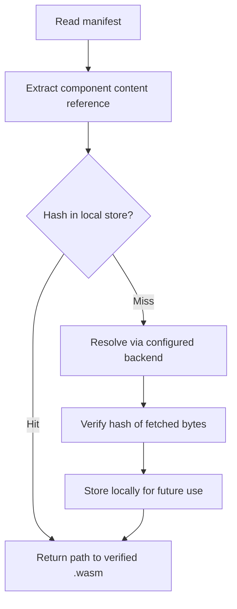
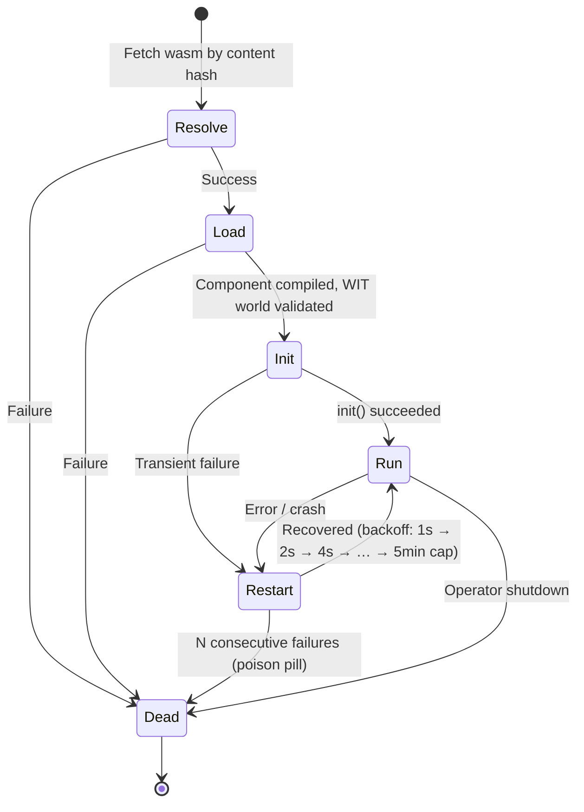
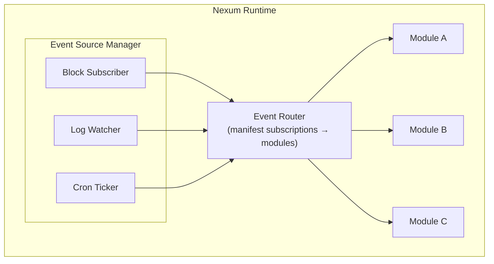

# Module Lifecycle, Event System & Packaging

## Module Package: the Nexum Module Bundle

A module is distributed as a **bundle** - a WASM component plus a manifest that declares its identity, event subscriptions, chain requirements, and resource limits. The manifest is the bridge between packaging, the event system, and the runtime lifecycle.

### Manifest (`nexum.toml`)

Every module ships with a manifest:

```toml
[module]
name = "twap-monitor"
version = "0.3.0"
description = "Monitors and posts TWAP order parts"
authors = ["mfw78.eth"]

# Content hash of the compiled .wasm component
component = "sha256:9f86d081884c7d659a2feaa0c55ad015a3bf4f1b2b0b822cd15d6c15b0f00a08"

[module.resources]
max_memory_bytes = 10_485_760   # 10 MB
max_fuel_per_event = 100_000
max_state_bytes = 52_428_800    # 50 MB

[module.restart]
max_consecutive_failures = 10   # Dead after this many consecutive failures

# Chain requirements - the runtime provides RPC for these
[chains]
required = [42161]               # Arbitrum (must have)
optional = [1, 100]              # Mainnet, Gnosis (used if available)

# Capability negotiation (new in 0.2) - which host primitives the module needs.
# Optional imports trap with host-error { kind: unsupported } on call rather
# than failing instantiation. Omitting this section falls back to
# "all imports required" with a deprecation warning.
[capabilities]
required = ["chain", "local-store", "logging"]
optional = ["messaging", "remote-store"]
denied   = []

[capabilities.http]
allow = ["api.cow.fi"]            # outbound HTTP domain allowlist

# Event subscriptions - declares what the runtime should feed this module
[[subscription]]
kind = "block"
chain_id = 42161

[[subscription]]
kind = "log"
chain_id = 42161
address = "0xfdaFc9d1902f4e0b84f65F49f244b32b31013b74"
topics = ["0x…"]                 # ComposableCoW ConditionalOrderCreated

[[subscription]]
kind = "cron"
schedule = "*/5 * * * *"         # every 5 minutes

# Typed config - TOML values preserve their type at the guest (0.2)
[config]
cow_api_url = "https://api.cow.fi/arbitrum"
min_twap_interval_secs = 120     # integer stays integer
enable_alerts = true             # boolean stays boolean
```

Key design points:

- **`component` is a content hash**, not a filename. The runtime resolves it via the content store (see below). (Was `wasm = ...` in 0.1 - see the migration guide.)
- **`[[subscription]]` blocks are declarative.** The module doesn't set up its own subscriptions imperatively - the runtime reads the manifest and wires up event sources before calling `init`. The 0.1 spelling was `[[subscribe]]` with `type = ...`; 0.2 uses `[[subscription]]` with `kind = ...` because `type` is a reserved word in several binding languages.
- **`[capabilities]`** is new in 0.2 and now drives what the runtime links into the module's import space. See the migration guide for the full schema (including `[capabilities.http]` allowlists and `[capabilities.identity].methods` subsets).
- **`resources` are caps**, not requests. The runtime enforces them via wasmtime's `ResourceLimiter` and fuel system.
- **`chains.required`** - if the runtime doesn't have an RPC endpoint for a required chain, the module fails to load (fast, clear error).
- **`config`** is opaque to the runtime. 0.2 keeps 0.1's stringly-typed shape (`list<tuple<string, string>>`); the host flattens TOML scalars (numbers, booleans) to their string form on the way through. A typed `config-value` variant is on the 0.3 roadmap, bundled with the manifest-parser work.

### Bundle Format

A bundle is a **directory** with a fixed layout:

```
twap-monitor/
├── module.toml            # manifest
└── module.wasm            # compiled component (matches component hash)
```

The runtime validates that `sha256(module.wasm)` matches the hash in the manifest's `component` field (after stripping the `sha256:` scheme prefix). This integrity check applies regardless of transport.

How the directory is represented depends on the content backend:

| Backend | Bundle representation |
|---------|---------------------|
| Local filesystem | Directory on disk |
| Swarm | Swarm directory manifest (native directory support) |
| IPFS | UnixFS directory |
| OCI | OCI artifact with manifest + wasm layer |
| HTTPS | tar.gz archive (extracted after download) |

## Content-Addressed Distribution

Distribution is **agnostic** - the runtime resolves content by hash through pluggable backends. The manifest's `wasm` field is a content address; the `source` in the runtime config tells the runtime *where* to look.

### Content Reference Scheme

```
<scheme>:<hash>
```

| Scheme | Example | Resolution |
|--------|---------|------------|
| `sha256` | `sha256:9f86d08…` | Local content store lookup |
| `bzz` | `bzz:22cbb9cedc…` | Ethereum Swarm (64-char hex, 256-bit) |
| `ipfs` | `ipfs:QmYwAPJz…` | IPFS CID |
| `oci` | `oci:ghcr.io/org/twap:0.3.0` | OCI registry (CNCF WASM artifact format) |
| `https` | `https://example.com/twap.wasm` | Direct HTTP fetch (hash-verified after download) |

### Runtime Content Store

The runtime maintains a local content-addressed store (a directory of blobs keyed by hash). Resolution flow:



### Runtime Source Configuration

The operator configures available backends in the runtime config:

```toml
[[content.sources]]
type = "local"
path = "/var/nexum/modules"

[[content.sources]]
type = "swarm"
bee_api = "http://localhost:1633"

[[content.sources]]
type = "oci"
registry = "ghcr.io"

# Sources are tried in order; first match wins.
```

This means:
- A **local dev** just drops `.wasm` files in a directory.
- A **production deployment** fetches from Swarm or OCI on first load, then caches locally.
- **Integrity is always verified** - the content hash in the manifest is the trust anchor, not the transport.

## Module Lifecycle



### States

| State | Description |
|-------|-------------|
| **Resolve** | Content store resolves `component` hash to local path. Fail -> `Dead`. |
| **Load** | `Component::from_file`, create `InstancePre`. Validates that the component satisfies the target WIT world (`nexum:host/event-module` or `shepherd:cow/shepherd`). Installs trap stubs for capabilities the manifest declares `optional` but the host does not provide. Fail -> `Dead`. |
| **Init** | Create `Store`, instantiate, call `init(config)` inside an implicit write transaction (same semantics as `on_event` - commit on success, rollback on failure). Module sets up internal state. Fail -> `Restart` (might be transient). |
| **Run** | Runtime dispatches events to `on_event`. Each call gets a fuel budget. Module processes events and may call host imports (chain, local-store, identity, cow-api, etc.). |
| **Restart** | After a trap or error. Backoff: 1s -> 2s -> 4s -> ... -> 5min cap. A fresh `Store` is created (clean memory), but **local-store data persists** (it's in redb, external to the WASM instance). |
| **Dead** | After N consecutive failures (poison pill detection) or explicit operator shutdown. No further event dispatch. Requires manual intervention. |

### Key Lifecycle Properties

- **State survives restarts.** The redb key-value store is external to the WASM instance. A restarted module picks up where it left off.
- **Memory does not survive restarts.** Each restart creates a fresh `Store` - clean linear memory, no stale pointers.
- **`InstancePre` is reused.** Compilation and linking are done once at Load. Restarts only create a new `Store` and call `init` again.
- **Config is immutable for a loaded module.** Changing config requires a reload (new Load cycle).
- **Hot-reload sequence.** When a module update is detected (e.g. ENS contenthash changed): (1) let the current in-flight `on_event` complete, (2) stop event dispatch for this module, (3) fetch and compile the new `Component`, (4) create new `InstancePre`, (5) create fresh `Store`, (6) call `init` with new config - state table is inherited (module handles migration), (7) resume event dispatch. The old `InstancePre` is dropped.

## Event System

### Architecture



### Event Sources

| Source | Trigger | Backed by |
|--------|---------|-----------|
| `block` | New block on a chain | `eth_subscribe("newHeads")` via alloy `Provider` |
| `log` | Matching log emitted | `eth_subscribe("logs", filter)` via alloy |
| `cron` | Schedule fires | Tokio `interval` / cron expression parser |

Event sources are **shared**. If two modules subscribe to blocks on chain 42161, the runtime maintains a single block subscription and fans out to both.

### Event Router

The router is the core dispatch table. Built at load time from all module manifests:

```rust
struct EventRouter {
    /// block subscriptions: chain_id → [ModuleHandle]
    block_subs: HashMap<u64, Vec<ModuleHandle>>,
    /// log subscriptions: (chain_id, filter_key) → [ModuleHandle]
    log_subs: HashMap<(u64, LogFilterKey), Vec<ModuleHandle>>,
    /// cron subscriptions: schedule → [ModuleHandle]
    cron_subs: Vec<(CronSchedule, ModuleHandle)>,
}
```

When an event fires:

1. Router looks up which modules are subscribed.
2. For each module, spawns a Tokio task (or uses a task pool) to call `on_event`.
3. Each call gets its own fuel budget from the manifest's `max_fuel_per_event`.
4. If the call traps (fuel exhaustion, panic, etc.), the module enters the Restart path.

### Dispatch Semantics

- **Concurrent across modules.** A block event is dispatched to all subscribed modules concurrently. One slow module does not block another.
- **Sequential within a module.** Events for the same module are dispatched in order. A module sees block N before block N+1. This is enforced by a per-module dispatch queue (Tokio `mpsc` channel).
- **Best-effort delivery.** If a module is in Restart state when an event arrives, the event is queued (bounded buffer). If the buffer fills, oldest events are dropped and a warning is logged.
- **No acknowledgement.** A successful return from `on_event` is not an ack. The module is responsible for using the local-store to track its own progress (e.g. "last processed block").
- **Catch-up after gaps.** Events can be dropped during restart (bounded buffer overflow). Modules should query for missed data on startup - e.g. in `init`, read `last_block` from local-store, use the alloy `Provider` (backed by `chain::request`) to call `get_block_number()` and `get_logs()` to backfill any gap. This is a best practice, not enforced by the runtime.

### Event Type Encoding

Events cross the WASM boundary as the `event` variant defined in the WIT:

```wit
variant event {
    block(block),
    logs(list<log>),
    tick(tick),
    message(message),
}

record block {
    chain-id: u64,
    number: u64,
    hash: list<u8>,
    timestamp: u64,         // milliseconds since Unix epoch, UTC
}

record tick {
    fired-at: u64,          // milliseconds since Unix epoch, UTC
}
```

The runtime serialises event data via the canonical ABI (handled automatically by `bindgen!`). Note the 0.2 semantic change: all `u64` timestamps in 0.2 are **milliseconds since Unix epoch, UTC**. The 0.1 WIT did not specify a unit and several sources used seconds - audit any timestamp arithmetic. The `tick` variant (formerly `timer(u64)`) is now a record so bindings read `event.tick.firedAt` instead of comparing a bare integer.

## Updated WIT Worlds

The initial WIT in `01-runtime-environment.md` is extended to support the lifecycle and config. The architecture uses two packages: `nexum:host` for universal interfaces and `shepherd:cow` for CoW Protocol extensions.

### Universal Package: `nexum:host@0.2.0`

```wit
package nexum:host@0.2.0;

interface types {
    type chain-id = u64;

    record block {
        chain-id: chain-id,
        number: u64,
        hash: list<u8>,
        timestamp: u64,         // ms since Unix epoch, UTC
    }

    record log {
        chain-id: chain-id,
        address: list<u8>,
        topics: list<list<u8>>,
        data: list<u8>,
        block-number: u64,
        transaction-hash: list<u8>,
        log-index: u32,
    }

    record tick {
        fired-at: u64,          // ms since Unix epoch, UTC
    }

    record message {
        content-topic: string,
        payload: list<u8>,
        timestamp: u64,         // ms since Unix epoch, UTC
        sender: option<list<u8>>,
    }

    variant event {
        block(block),
        logs(list<log>),
        tick(tick),
        message(message),
    }

    /// Opaque config from nexum.toml [config] section. TOML scalars are
    /// flattened to strings by the host. A typed config-value variant is
    /// on the 0.3 roadmap, bundled with the manifest-parser work.
    type config = list<tuple<string, string>>;

    /// Unified host error (replaces the five per-protocol errors from 0.1).
    record host-error {
        domain: string,
        kind: host-error-kind,
        code: s32,
        message: string,
        data: option<string>,
    }

    variant host-error-kind {
        unsupported, unavailable, denied, rate-limited,
        timeout, invalid-input, internal,
    }
}

interface chain {
    use types.{chain-id, host-error};

    /// Generic JSON-RPC passthrough. See doc 07 for full design rationale.
    request: func(chain-id: chain-id, method: string, params: string)
        -> result<string, host-error>;

    /// Additive 0.2: batched JSON-RPC.
    request-batch: func(chain-id: chain-id, calls: list<tuple<string, string>>)
        -> result<list<result<string, host-error>>, host-error>;
}

interface local-store {
    use types.{host-error};
    get: func(key: string) -> result<option<list<u8>>, host-error>;
    set: func(key: string, value: list<u8>) -> result<_, host-error>;
    delete: func(key: string) -> result<_, host-error>;
    list-keys: func(prefix: string) -> result<list<string>, host-error>;
}

interface logging {
    enum level { trace, debug, info, warn, error }
    log: func(level: level, message: string);
}

interface identity {
    use types.{host-error};
    accounts: func() -> result<list<list<u8>>, host-error>;
    sign: func(account: list<u8>, data: list<u8>) -> result<list<u8>, host-error>;
    sign-typed-data: func(account: list<u8>, typed-data: string) -> result<list<u8>, host-error>;
}

/// Universal event-driven module world - platform-agnostic. Imports the six
/// primitives in 0.2 (identity was missing from the 0.1 WIT despite being
/// part of the primitive taxonomy).
world event-module {
    import chain;
    import identity;
    import local-store;
    import remote-store;
    import messaging;
    import logging;

    /// Called once on load. Receives typed config from nexum.toml.
    export init: func(config: types.config) -> result<_, host-error>;

    /// Called for each subscribed event.
    export on-event: func(event: types.event) -> result<_, host-error>;
}
```

### CoW-Specific Package: `shepherd:cow@0.2.0`

```wit
package shepherd:cow@0.2.0;

interface cow-api {
    use nexum:host/types.{chain-id, host-error};

    /// HTTP-style request to the CoW Protocol API.
    request: func(
        chain-id: chain-id,
        method: string,
        path: string,
        body: option<string>,
    ) -> result<string, host-error>;

    /// Submit a serialised order. (Merged in from the 0.1 `order` interface.)
    submit-order: func(chain-id: chain-id, order-data: list<u8>)
        -> result<string, host-error>;
}

/// CoW Protocol module world - extends event-module with cow-api.
world shepherd {
    include nexum:host/event-module;

    import cow-api;
}
```

## Putting It All Together

Operator deploys a module:

```
1. Operator adds entry to runtime config:

   [[modules]]
   manifest = "/var/nexum/twap-monitor/nexum.toml"

2. Runtime reads manifest:
   - Resolves component content hash → fetches from Swarm/local/OCI
   - Verifies integrity (sha256 match)

3. Runtime compiles Component, creates InstancePre:
   - Validates component satisfies target world
     (nexum:host/event-module or shepherd:cow/shepherd)
   - Installs trap stubs for any [capabilities].optional imports the host doesn't provide
   - Enforces resource limits from manifest

4. Runtime calls init(config):
   - Module receives [config] section as typed key-value pairs
   - Module sets up internal state, logs readiness

5. Runtime wires event sources from [[subscription]] blocks:
   - Creates/reuses block subscriber for chain 42161
   - Creates log watcher with address + topic filter
   - Registers cron schedule

6. Events flow:
   Block 19_000_001 on Arbitrum
   → Router → twap-monitor's dispatch queue
   → Tokio task calls on_event(Event::Block(…))
   → Module calls chain::request (via alloy Provider), local-store get, cow-api submit-order
   → Returns Ok(()) - runtime logs success

7. On crash:
   → Module trapped (fuel exhaustion / panic)
   → Runtime logs error, enters Restart state
   → Backoff 1s, creates fresh Store, calls init again
   → Local-store data still intact - module resumes
```
