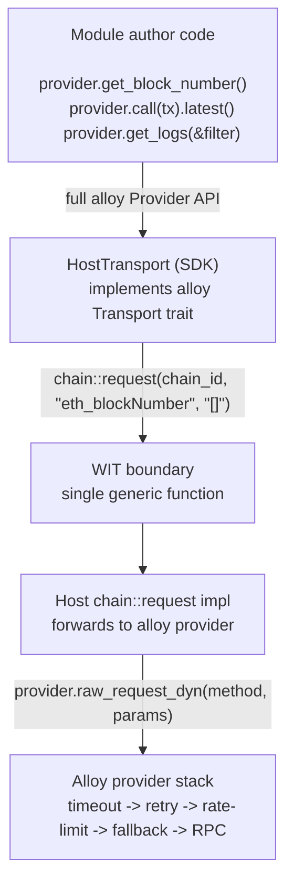
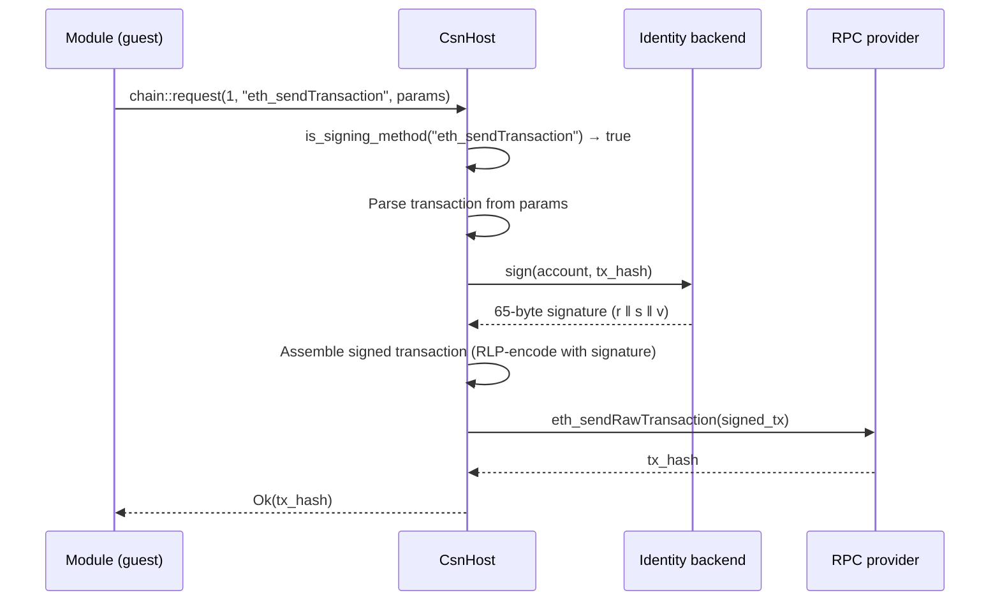

# RPC Namespace Design: Generic JSON-RPC Passthrough

> **Naming note (0.2):** This document describes the `chain` interface in the
> `nexum:host` WIT package. In the 0.1 design history it was called `chain`
> (short for "consensus"); 0.2 renamed it to `chain` because `chain.request(...)`
> reads itself at the call site. The function signatures below are the 0.2 shape,
> returning `host-error` rather than the 0.1-era `json-rpc-error`.
>
> **SDK-shape note (0.2):** The macro-driven authoring model below (`#[nexum::module]` / `#[shepherd::module]` with named event handlers and `&RootProvider` injection) and the separate `nexum-sdk` crate are **future direction, not in 0.2 scope** - see [ADR-0009](adr/0009-host-trait-surface.md) for the shipped host-trait seam that replaces the macro design. 0.2 modules call `host.request(chain_id, method, params_json)` directly against `ChainHost`. The WIT contract for `chain` is unchanged; only the guest-side ergonomics differ.

## Problem Statement

The 0.1 design started with a `blockchain` interface that defined individual functions for each Ethereum RPC method:

```wit
interface blockchain {
    eth-call: func(chain-id: chain-id, to: list<u8>, data: list<u8>) -> result<list<u8>, string>;
    eth-get-logs: func(filter: log-filter) -> result<list<log-entry>, string>;
    eth-block-number: func(chain-id: chain-id) -> result<u64, string>;
}
```

This creates several problems:

1. **Boilerplate multiplication.** Every new `eth_` method requires changes in three places: WIT definition, host trait implementation, and SDK wrapper. The Ethereum JSON-RPC namespace has 30+ methods; most modules will need more than the three currently exposed.

2. **Alloy incompatibility.** Module authors using Rust cannot use alloy's `Provider` API - which provides 80+ typed convenience methods - because the transport layer is locked behind per-method WIT functions. They're forced to manually ABI-encode calldata, call `blockchain::eth_call`, and ABI-decode the result for every interaction.

3. **Namespace rigidity.** Adding a `cow_` namespace for CoW Protocol API calls would duplicate the same per-method pattern. Future namespaces (debug_, trace_, etc.) compound this further.

The goal: **one WIT function to rule the entire `eth_` namespace**, with a guest-side SDK that gives module authors the full alloy `Provider` API - no manual ABI wrangling, no WIT changes when new methods are needed.

## Design: Generic JSON-RPC Passthrough

### Core Insight

alloy's `Transport` trait is a Tower `Service<RequestPacket, Response = ResponsePacket>`. If we expose a single JSON-RPC dispatch function in WIT, the SDK can implement `Transport` on top of it. This gives guest modules the entire alloy `Provider` API for free - every current and future `eth_` method works automatically.

From the guest's perspective, host function calls are synchronous (they block until the host returns). The returned future resolves in a single poll. This means alloy's async `Provider` methods work with a trivial executor - no real async machinery needed.

### Architecture



## Updated WIT Interface

Replace the `blockchain` interface with `chain`:

```wit
package nexum:host@0.2.0;

interface chain {
    use types.{chain-id, host-error};

    /// Execute a JSON-RPC request against the specified chain.
    ///
    /// The host forwards the request to the configured alloy provider for the
    /// given chain, applying timeout/retry/rate-limit/fallback middleware
    /// transparently. The method string should include the namespace prefix
    /// (e.g. "eth_call", "eth_getBlockByNumber").
    ///
    /// `params` and the success return value are JSON-encoded strings matching
    /// the JSON-RPC specification. The host handles id/jsonrpc framing; the
    /// guest only provides method + params and receives the `result` field.
    request: func(chain-id: chain-id, method: string, params: string)
        -> result<string, host-error>;

    /// 0.2 additive: batched JSON-RPC. alloy's HostTransport routes
    /// RequestPacket::Batch through this, so provider.multicall(...) actually
    /// batches on the wire (it silently fanned-out single requests in 0.1).
    request-batch: func(chain-id: chain-id, calls: list<tuple<string, string>>)
        -> result<list<result<string, host-error>>, host-error>;
}
```

Errors are reported via the unified `host-error` (see doc 00 and the [migration guide §2](migration/0.1-to-0.2.md#2-error-model-unification-both)) - the 0.1 `json-rpc-error` shape is gone. Modules match on `host-error-kind` (`unavailable`, `rate-limited`, `timeout`, `denied`, `invalid-input`, ...) for retry/backoff decisions rather than parsing numeric JSON-RPC codes.

The `types` interface is unchanged in shape (it now exposes `host-error` / `host-error-kind`). The `local-store`, `remote-store`, `messaging`, and `logging` interfaces are unchanged.

The `identity` interface provides cryptographic identity - key management and signing:

```wit
interface identity {
    use types.{host-error};

    /// Get available signing accounts (20-byte Ethereum addresses).
    accounts: func() -> result<list<list<u8>>, host-error>;

    /// Sign raw bytes with the specified account.
    /// Returns a 65-byte ECDSA secp256k1 signature (r ‖ s ‖ v).
    sign: func(account: list<u8>, data: list<u8>) -> result<list<u8>, host-error>;

    /// Sign EIP-712 typed data with the specified account.
    sign-typed-data: func(account: list<u8>, typed-data: string) -> result<list<u8>, host-error>;
}
```

The universal `event-module` world (in `nexum:host`) contains the platform-agnostic interfaces - six imports in 0.2:

```wit
world event-module {
    import chain;        // replaces `import blockchain;` from the early 0.1 sketch
    import identity;     // cryptographic identity (key management, signing)
    import local-store;
    import remote-store;
    import messaging;
    import logging;

    export init: func(config: types.config) -> result<_, host-error>;
    export on-event: func(event: types.event) -> result<_, host-error>;
}
```

The CoW-specific `shepherd` world (in `shepherd:cow`) extends it with the merged `cow-api` interface:

```wit
world shepherd {
    include nexum:host/event-module;
    import cow-api;
}
```

### What This Replaces

| Before (per-method) | After (generic) |
|---|---|
| `blockchain::eth-call(chain-id, to, data)` | `chain::request(chain-id, "eth_call", params_json)` |
| `blockchain::eth-get-logs(filter)` | `chain::request(chain-id, "eth_getLogs", params_json)` |
| `blockchain::eth-block-number(chain-id)` | `chain::request(chain-id, "eth_blockNumber", "[]")` |
| *n/a - not exposed* | `chain::request(chain-id, "eth_getBalance", params_json)` |
| *n/a - not exposed* | `chain::request(chain-id, "eth_getCode", params_json)` |
| *n/a - not exposed* | `chain::request(chain-id, "eth_getStorageAt", params_json)` |
| *n/a - not exposed* | Any `eth_*` method - no WIT change needed |

### Why JSON Strings (Not `list<u8>`)

- The Ethereum JSON-RPC spec is JSON. alloy serialises params to JSON internally. Using `string` means zero intermediate format - the guest produces JSON, the host forwards JSON to alloy's `raw_request_dyn` which accepts `&RawValue` (a JSON string).
- Debuggability: JSON is human-readable in logs and traces.
- The canonical ABI cost of copying a JSON string across the component boundary is negligible relative to the network RTT of an actual RPC call.
- Binary encoding (CBOR, postcard) would require custom (de)serialisation on both sides, defeating the purpose of minimising boilerplate.

## Host Implementation

The host implementation is minimal - one function handles the entire `eth_` namespace:

```rust
use serde_json::value::RawValue;

impl nexum::host::chain::Host for NexumHostState {
    async fn request(
        &mut self,
        chain_id: u64,
        method: String,
        params: String,
    ) -> wasmtime::Result<Result<String, HostError>> {
        // 1. Check if this is a signing method that requires identity delegation
        if self.is_signing_method(&method) {
            return self.dispatch_signing(chain_id, &method, &params).await;
        }

        // 2. Method allowlisting for read-only methods
        if !self.is_read_method_allowed(&method) {
            return Ok(Err(HostError {
                domain: "chain".into(),
                kind: HostErrorKind::Denied,
                code: -32601,
                message: format!("method not allowed: {method}"),
                data: None,
            }));
        }

        // 3. Resolve the provider for this chain
        let provider = self.provider_for(chain_id).map_err(|e| {
            HostError {
                domain: "chain".into(),
                kind: HostErrorKind::Unsupported,
                code: -32002,
                message: format!("unknown chain: {chain_id}"),
                data: None,
            }
        })?;

        // 4. Parse params as raw JSON and forward to alloy
        let raw_params: Box<RawValue> = RawValue::from_string(params)
            .map_err(|e| wasmtime::Error::msg(format!("invalid JSON params: {e}")))?;

        match provider.raw_request_dyn(method.into(), &raw_params).await {
            Ok(result) => Ok(Ok(result.get().to_string())),
            Err(e) => Ok(Err(HostError::from_transport("chain", e))),
        }
    }
}
```

That's it. The alloy provider already has the timeout/retry/rate-limit/fallback tower stack configured per chain (see doc 01). Every read-only `eth_*` method automatically inherits that middleware.

### Method Allowlisting

The host maintains two categories of methods: **read-only methods** (always allowed through the RPC passthrough) and **signing methods** (delegated to the `identity` backend).

#### Read-Only Methods (RPC Passthrough)

```rust
impl NexumHostState {
    fn is_read_method_allowed(&self, method: &str) -> bool {
        // Default allowlist: read-only eth_ methods
        matches!(method,
            "eth_blockNumber"
            | "eth_call"
            | "eth_chainId"
            | "eth_estimateGas"
            | "eth_feeHistory"
            | "eth_gasPrice"
            | "eth_maxPriorityFeePerGas"
            | "eth_getBalance"
            | "eth_getBlockByHash"
            | "eth_getBlockByNumber"
            | "eth_getBlockReceipts"
            | "eth_getCode"
            | "eth_getLogs"
            | "eth_getProof"
            | "eth_getStorageAt"
            | "eth_getTransactionByHash"
            | "eth_getTransactionCount"
            | "eth_getTransactionReceipt"
            // net_ methods
            | "net_version"
        )
    }
}
```

This could be made configurable per-module via `nexum.toml`:

```toml
[module.chain]
# Additional methods beyond the default read-only set.
# Use with caution - write methods can have side-effects.
extra_allowed_methods = ["eth_createAccessList"]
```

The allowlist is runtime-enforced (string matching), not compile-time. This is an acceptable trade-off: the Component Model already provides structural sandboxing (modules can only call `chain::request`, not arbitrary network I/O), and the allowlist adds defence-in-depth for method-level granularity.

#### Signing Methods (Identity Delegation)

When a module calls `chain::request` with a signing method, the host does **not** forward the request to the RPC provider. Instead, it delegates to the `identity` backend for signing, then broadcasts the signed result via RPC.

```rust
impl NexumHostState {
    fn is_signing_method(&self, method: &str) -> bool {
        matches!(method,
            "eth_sendTransaction"
            | "eth_accounts"
            | "eth_signTypedData_v4"
            | "personal_sign"
        )
    }
}
```

These methods are deliberately **not** in the read-only allowlist. They follow a completely different code path through the identity backend.

### Identity Delegation Flow

When a module calls a signing method through `chain::request`, the host intercepts it and delegates to the `Identity` trait:



The key insight: modules never call `eth_sendRawTransaction` directly (it's not in the read-only allowlist). Instead, `eth_sendTransaction` is intercepted by the host, which uses the `identity` backend to sign, then broadcasts the signed transaction itself.

This pattern applies to all signing methods:

| Method | Identity Delegation |
|---|---|
| `eth_accounts` | Returns accounts from `Identity::accounts()` |
| `eth_sendTransaction` | Signs the transaction via `Identity::sign()`, broadcasts via `eth_sendRawTransaction` |
| `eth_signTypedData_v4` | Signs EIP-712 typed data via `Identity::sign_typed_data()` |
| `personal_sign` | Signs the message via `Identity::sign()` (with EIP-191 prefix) |

### Identity Trait and ChainHost

The host's `chain` implementation is generic over an `Identity` trait. This allows different identity backends (hardware wallet, KMS, in-memory test keys, etc.):

```rust
/// Trait for identity backends that provide signing capabilities.
///
/// The host's chain implementation delegates signing methods to this trait.
/// Implementations can back onto hardware wallets, cloud KMS, in-memory
/// test keys, or any other signing infrastructure.
pub trait Identity: Send + Sync {
    /// Get available signing accounts (20-byte Ethereum addresses).
    fn accounts(&self) -> Result<Vec<Vec<u8>>, IdentityBackendError>;

    /// Sign raw bytes with the specified account.
    /// Returns a 65-byte ECDSA secp256k1 signature (r ‖ s ‖ v).
    fn sign(&self, account: &[u8], data: &[u8]) -> Result<Vec<u8>, IdentityBackendError>;

    /// Sign EIP-712 typed data with the specified account.
    fn sign_typed_data(&self, account: &[u8], typed_data: &str) -> Result<Vec<u8>, IdentityBackendError>;
}

/// The host state is generic over the identity backend.
pub struct ChainHost<I: Identity> {
    providers: HashMap<u64, RootProvider>,
    identity: I,
}

impl<I: Identity> nexum::host::chain::Host for ChainHost<I> {
    async fn request(
        &mut self,
        chain_id: u64,
        method: String,
        params: String,
    ) -> wasmtime::Result<Result<String, HostError>> {
        if self.is_signing_method(&method) {
            return self.dispatch_signing(chain_id, &method, &params).await;
        }

        if !self.is_read_method_allowed(&method) {
            return Ok(Err(HostError {
                domain: "chain".into(),
                kind: HostErrorKind::Denied,
                code: -32601,
                message: format!("method not allowed: {method}"),
                data: None,
            }));
        }

        let provider = self.provider_for(chain_id)?;
        let raw_params: Box<RawValue> = RawValue::from_string(params)
            .map_err(|e| wasmtime::Error::msg(format!("invalid JSON params: {e}")))?;

        match provider.raw_request_dyn(method.into(), &raw_params).await {
            Ok(result) => Ok(Ok(result.get().to_string())),
            Err(e) => Ok(Err(HostError::from_transport("chain", e))),
        }
    }
}

impl<I: Identity> ChainHost<I> {
    /// Dispatch signing methods to the identity backend.
    async fn dispatch_signing(
        &self,
        chain_id: u64,
        method: &str,
        params: &str,
    ) -> wasmtime::Result<Result<String, HostError>> {
        match method {
            "eth_accounts" => {
                let accounts = self.identity.accounts().map_err(|e| HostError {
                    domain: "identity".into(),
                    kind: HostErrorKind::Internal,
                    code: -32000,
                    message: e.message,
                    data: None,
                })?;
                let hex_accounts: Vec<String> = accounts
                    .iter()
                    .map(|a| format!("0x{}", hex::encode(a)))
                    .collect();
                Ok(Ok(serde_json::to_string(&hex_accounts)?))
            }

            "eth_sendTransaction" => {
                let provider = self.provider_for(chain_id)?;
                // Parse the transaction params
                let tx_params: Vec<serde_json::Value> = serde_json::from_str(params)?;
                let tx = &tx_params[0];

                let from = parse_address(tx.get("from"))?;

                // Fill missing fields (nonce, gas, etc.) via the provider
                let filled_tx = self.fill_transaction(provider, tx).await?;

                // Hash the transaction and sign it
                let tx_hash = filled_tx.signing_hash();
                let signature = self.identity.sign(&from, tx_hash.as_ref())
                    .map_err(|e| HostError {
                        domain: "identity".into(),
                        kind: HostErrorKind::Internal,
                        code: -32000,
                        message: e.to_string(),
                        data: None,
                    })?;

                // Assemble signed transaction and broadcast
                let signed_tx = filled_tx.with_signature(&signature);
                let raw_tx = signed_tx.rlp_encode();

                let raw_params = serde_json::to_string(&[format!("0x{}", hex::encode(&raw_tx))])?;
                let raw_params_box: Box<RawValue> = RawValue::from_string(raw_params)?;
                match provider.raw_request_dyn("eth_sendRawTransaction".into(), &raw_params_box).await {
                    Ok(result) => Ok(Ok(result.get().to_string())),
                    Err(e) => Ok(Err(HostError::from_transport("chain", e))),
                }
            }

            "eth_signTypedData_v4" => {
                let params_arr: Vec<serde_json::Value> = serde_json::from_str(params)?;
                let account = parse_address(&params_arr[0])?;
                let typed_data = params_arr[1].to_string();

                let signature = self.identity.sign_typed_data(&account, &typed_data)
                    .map_err(|e| HostError {
                        domain: "identity".into(),
                        kind: HostErrorKind::Internal,
                        code: -32000,
                        message: e.to_string(),
                        data: None,
                    })?;
                Ok(Ok(format!("\"0x{}\"", hex::encode(&signature))))
            }

            "personal_sign" => {
                let params_arr: Vec<serde_json::Value> = serde_json::from_str(params)?;
                let data = parse_hex_bytes(&params_arr[0])?;
                let account = parse_address(&params_arr[1])?;

                // EIP-191 prefix
                let prefixed = format!("\x19Ethereum Signed Message:\n{}", data.len());
                let mut msg = prefixed.into_bytes();
                msg.extend_from_slice(&data);
                let hash = keccak256(&msg);

                let signature = self.identity.sign(&account, &hash)
                    .map_err(|e| HostError {
                        domain: "identity".into(),
                        kind: HostErrorKind::Internal,
                        code: -32000,
                        message: e.to_string(),
                        data: None,
                    })?;
                Ok(Ok(format!("\"0x{}\"", hex::encode(&signature))))
            }

            _ => Ok(Err(HostError {
                domain: "chain".into(),
                kind: HostErrorKind::InvalidInput,
                code: -32601,
                message: format!("unknown signing method: {method}"),
                data: None,
            })),
        }
    }
}
```

The `ChainHost` also implements `nexum::host::identity::Host` directly, delegating to the same `Identity` trait so modules can use the identity WIT interface for raw signing (errors map to `host-error` with `domain = "identity"`):

```rust
impl<I: Identity> nexum::host::identity::Host for ChainHost<I> {
    fn accounts(&mut self) -> wasmtime::Result<Result<Vec<Vec<u8>>, HostError>> {
        Ok(self.identity.accounts().map_err(|e| HostError {
            domain: "identity".into(),
            kind: e.kind(),     // backend chooses unavailable/denied/internal
            code: 0,
            message: e.to_string(),
            data: None,
        }))
    }

    fn sign(
        &mut self,
        account: Vec<u8>,
        data: Vec<u8>,
    ) -> wasmtime::Result<Result<Vec<u8>, HostError>> {
        Ok(self.identity.sign(&account, &data).map_err(|e| e.into_host_error("identity")))
    }

    fn sign_typed_data(
        &mut self,
        account: Vec<u8>,
        typed_data: String,
    ) -> wasmtime::Result<Result<Vec<u8>, HostError>> {
        Ok(self.identity.sign_typed_data(&account, &typed_data)
            .map_err(|e| e.into_host_error("identity")))
    }
}
```

## Guest SDK: `HostTransport`

The key SDK addition is a `HostTransport` struct that implements alloy's `Transport` trait by routing through the WIT `chain::request` host function.

### Transport Implementation

```rust
use alloy_json_rpc::{
    ErrorPayload, RequestPacket, Response, ResponsePacket, ResponsePayload,
    SerializedRequest,
};
use alloy_transport::{BoxTransport, Transport, TransportError, TransportFut};
use tower::Service;
use std::task::{Context, Poll};

/// An alloy-compatible transport that routes JSON-RPC requests through the
/// Nexum host engine. Synchronous from the guest's perspective - the host
/// function blocks until the RPC response is available.
#[derive(Debug, Clone)]
pub struct HostTransport {
    chain_id: u64,
}

impl HostTransport {
    pub fn new(chain_id: u64) -> Self {
        Self { chain_id }
    }
}

impl Service<RequestPacket> for HostTransport {
    type Response = ResponsePacket;
    type Error = TransportError;
    type Future = TransportFut<'static>;

    fn poll_ready(&mut self, _cx: &mut Context<'_>) -> Poll<Result<(), Self::Error>> {
        // Always ready - host function calls are synchronous from the guest.
        Poll::Ready(Ok(()))
    }

    fn call(&mut self, req: RequestPacket) -> Self::Future {
        let chain_id = self.chain_id;
        Box::pin(async move {
            match req {
                RequestPacket::Single(req) => {
                    let resp = dispatch_single(chain_id, &req)?;
                    Ok(ResponsePacket::Single(resp))
                }
                RequestPacket::Batch(reqs) => {
                    // 0.2: route batches through chain::request-batch so the
                    // host actually pipelines them on the wire.
                    let calls: Vec<(String, String)> = reqs.iter()
                        .map(|r| (r.method().to_string(),
                                  r.params().map(|p| p.get()).unwrap_or("[]").to_string()))
                        .collect();
                    let results = chain::request_batch(chain_id, &calls)
                        .map_err(|e| TransportError::from_host(e))?;
                    let resps: Vec<_> = reqs.iter().zip(results.into_iter())
                        .map(|(req, result)| build_response(req, result))
                        .collect();
                    Ok(ResponsePacket::Batch(resps))
                }
            }
        })
    }
}

impl Transport for HostTransport {
    fn boxed(self) -> BoxTransport
    where
        Self: Sized + Clone + Send + Sync + 'static,
    {
        BoxTransport::new(self)
    }
}

/// Dispatch a single JSON-RPC request through the host function.
fn dispatch_single(
    chain_id: u64,
    req: &SerializedRequest,
) -> Result<Response<Box<RawValue>>, TransportError> {
    let method = req.method();
    let params_json = req.params().map(|p| p.get()).unwrap_or("[]");

    // This calls the WIT-imported host function. Synchronous from the guest's
    // perspective - the host executes the RPC call asynchronously and returns
    // the result when ready.
    match chain::request(chain_id, method, params_json) {
        Ok(result_json) => {
            let payload: Box<RawValue> = RawValue::from_string(result_json)
                .map_err(|e| TransportError::deser_err(e, "host response"))?;
            Ok(Response {
                id: req.id().clone(),
                payload: ResponsePayload::Success(payload),
            })
        }
        Err(e) => {
            // Map the host-error onto an alloy error payload, encoding the
            // kind/domain into `data` so the caller can recover the
            // discriminant via HostError::from_response.
            Ok(Response {
                id: req.id().clone(),
                payload: ResponsePayload::Failure(ErrorPayload {
                    code: e.code as i64,
                    message: e.message,
                    data: Some(RawValue::from_string(
                        serde_json::to_string(&HostErrorWire::from(e)).unwrap()
                    ).unwrap()),
                }),
            })
        }
    }
}
```

### Why This Works Without Real Async

The `call()` method returns a `Box::pin(async move { ... })` - but the body is entirely synchronous. The `chain::request` host function blocks from the guest's perspective (the host runs the actual RPC call asynchronously via wasmtime's `func_wrap_async`, but the guest sees a normal function call that returns a value). The future resolves in a single poll.

This means alloy's `Provider` methods - which `await` the transport internally - complete immediately when driven by any executor. The SDK provides a minimal single-threaded executor:

```rust
/// Drive a future to completion. Since the HostTransport resolves
/// synchronously, this is a single-poll operation - no actual async
/// scheduling occurs.
pub fn block_on<F: Future>(future: F) -> F::Output {
    futures_executor::block_on(future)
}
```

`futures-executor` is no-std-compatible and adds no meaningful overhead.

### Provider Constructor

```rust
use alloy_provider::RootProvider;
use alloy_rpc_client::RpcClient;

/// Create an alloy `Provider` backed by the Nexum host engine.
///
/// The returned provider supports the full alloy `Provider` API - all `eth_*`
/// methods, builder patterns, typed responses - routing every request through
/// the host's RPC stack (timeout, retry, rate-limit, failover).
///
/// ```rust
/// let provider = nexum_sdk::provider(42161);
/// let block = provider.get_block_number().await?;
/// ```
pub fn provider(chain_id: u64) -> RootProvider {
    let transport = HostTransport::new(chain_id);
    let client = RpcClient::new(transport, false); // false = not local
    RootProvider::new(client)
}
```

## Eliminating `block_on`: Async Module Functions

### The Problem

alloy's `Provider` is async. Without help, module authors would need `block_on()` around every RPC call:

```rust
let block_num = block_on(provider.get_block_number())?;  // noisy
let balance = block_on(provider.get_balance(addr).latest())?;  // everywhere
```

This is verbose and obscures the actual logic. But we can't reimplement every `Provider` method as a synchronous wrapper - that defeats the purpose of the generic passthrough.

### The Solution: Named Event Handlers + `async fn`

The proc macro (see doc 05) already generates the WIT export boilerplate. We extend it in two ways. For universal modules, the `#[nexum::module]` macro is used; for CoW modules, the `#[shepherd::module]` macro (which extends the universal one with CoW-specific imports):

1. **Named event handlers** - instead of writing the `match event { ... }` dispatch manually, module authors implement `on_block`, `on_logs`, `on_tick`, and/or `on_message`. The macro generates the `on_event` match.
2. **`async fn` support** - handlers can be async. The macro wraps the generated `on_event` in `block_on()`, so `.await` works naturally.
3. **Provider injection** - if a handler accepts `&RootProvider` as a second parameter, the macro creates the provider from the event's chain_id and passes it in.

**What the module author writes (universal module):**

```rust
#[nexum::module]
struct MyModule;

impl MyModule {
    async fn on_block(block: Block, provider: &RootProvider) -> Result<()> {
        let block_num = provider.get_block_number().await?;       // natural .await
        let balance = provider.get_balance(addr).latest().await?; // no block_on
        Ok(())
    }

    async fn on_logs(logs: Vec<Log>, provider: &RootProvider) -> Result<()> {
        for log in &logs {
            // ...
        }
        Ok(())
    }

    // on_tick / on_message not defined -> those events are silently ignored
}
```

**What the module author writes (CoW module):**

```rust
#[shepherd::module]
struct MyModule;

impl MyModule {
    async fn on_block(block: Block, provider: &RootProvider) -> Result<()> {
        let cow = Cow::new(block.chain_id);
        let block_num = provider.get_block_number().await?;
        cow.submit_order(&order)?;
        Ok(())
    }
}
```

**What the macro generates:**

```rust
impl Guest for MyModule {
    fn on_event(event: types::Event) -> Result<(), HostError> {
        nexum_sdk::block_on(async {
            match event {
                Event::Block(block) => {
                    let provider = nexum_sdk::provider(block.chain_id);
                    MyModule::on_block(block, &provider).await
                }
                Event::Logs(logs) => {
                    let provider = nexum_sdk::provider(logs[0].chain_id);
                    MyModule::on_logs(logs, &provider).await
                }
                Event::Tick(_) => Ok(()),     // no handler defined
                Event::Message(_) => Ok(()),  // no handler defined
            }
        })
    }
}
```

The generated code calls `block_on` exactly once - at the top-level export boundary. Inside the async block, all `.await` calls resolve immediately (the `HostTransport` is synchronous under the hood). No real async scheduler runs. No tokio. No waker machinery. It's syntactic sugar that costs nothing at runtime.

### Named Handler Conventions

| Handler | Payload | Optional injectable context |
|---|---|---|
| `on_block(block)` | `Block` | `provider: &RootProvider` (from `block.chain_id`) |
| `on_logs(logs)` | `Vec<Log>` | `provider: &RootProvider` (from `logs[0].chain_id`) |
| `on_tick(tick)` | `Tick` (`tick.fired_at` is ms UTC) | None (no chain context) |
| `on_message(message)` | `Message` | None |

The macro inspects each handler's signature:
- **Second parameter is `&RootProvider`** -> inject `nexum_sdk::provider(chain_id)`
- **No second parameter** -> pass only the payload
- **Async handlers** -> wrapped in `block_on`; sync handlers called directly
- **Missing handlers** -> `Ok(())` for that variant (no-op)

**Escape hatch:** defining `on_event` directly takes precedence - the macro uses it as-is (wrapping in `block_on` if async) and ignores named handlers.

### Why This Works

1. **WIT exports are synchronous.** The Component Model export signature is `func(event) -> result<_, string>` - no async. The macro bridges this by wrapping the generated dispatch in `block_on`.

2. **The transport resolves in one poll.** `HostTransport::call()` returns a future whose body is entirely synchronous (it calls the WIT host function, which blocks). When alloy's `Provider` awaits the transport, the future completes immediately.

3. **`futures_executor::block_on` is trivial.** It creates a waker, polls the future once, gets `Poll::Ready`. No thread parking, no event loop. On WASM single-threaded targets this is a no-op wrapper.

4. **Composability.** Module authors can use alloy's builder patterns naturally inside any handler:

   ```rust
   async fn on_block(block: Block, provider: &RootProvider) -> Result<()> {
       // EthCall builder - .latest() and .await both work
       let result = provider.call(tx).latest().await?;

       // Filter builder - standard alloy ergonomics
       let logs = provider.get_logs(&filter).await?;

       // Raw request for unlisted methods
       let proof: EIP1186AccountProofResponse = provider
           .raw_request("eth_getProof".into(), (addr, keys, "latest"))
           .await?;
       Ok(())
   }
   ```

5. **Sync handlers still work.** Handlers that don't need RPC can be plain `fn`:

   ```rust
   fn on_tick(tick: Tick) -> Result<()> {
       info!("tick fired at {} ms UTC", tick.fired_at);
       Ok(())
   }
   ```

### Comparison

| Approach | Event dispatch boilerplate | RPC call boilerplate | New methods need shimming? | alloy-native? |
|---|---|---|---|---|
| Manual `on_event` + `block_on()` | `match event { ... }` every module | `block_on(...)` every call | No | Yes |
| **Named handlers + async macro** | **None (generated)** | **None (`.await`)** | **No** | **Yes** |

The named handler + async macro approach eliminates boilerplate at both the event dispatch level and the RPC call level.

## Module Author Experience

### Before (Per-Method WIT)

```rust
use nexum_sdk::prelude::*;
use nexum_sdk::abi::sol;

sol! {
    function balanceOf(address owner) view returns (uint256);
}

#[nexum::module]
struct MyModule;

impl MyModule {
    fn on_event(event: Event) -> Result<()> {
        if let Event::Block(block) = event {
            // Manual ABI encode
            let calldata = balanceOfCall { owner: addr }.abi_encode();

            // Raw host call - returns opaque bytes
            let result_bytes = blockchain::eth_call(
                block.chain_id,
                &token_addr.to_vec(),
                &calldata,
            )?;

            // Manual ABI decode
            let balance = balanceOfCall::abi_decode_returns(&result_bytes)?;

            // Want eth_getBalance? Not available. Want eth_getCode? Not available.
            // Each new method needs WIT + host + SDK changes.
        }
        Ok(())
    }
}
```

### After (Generic RPC + named handlers + provider injection)

```rust
use nexum_sdk::prelude::*;

sol! {
    function balanceOf(address owner) view returns (uint256);
}

#[nexum::module]
struct MyModule;

impl MyModule {
    // Named handler - macro generates the match dispatch + provider injection
    async fn on_block(block: Block, provider: &RootProvider) -> Result<()> {
        // Full alloy Provider API - natural .await, provider injected
        let block_num = provider.get_block_number().await?;
        let eth_balance = provider.get_balance(addr).latest().await?;
        let code = provider.get_code_at(contract).latest().await?;

        // Typed contract calls with the EthCall builder
        let tx = TransactionRequest::default()
            .to(token_addr)
            .input(balanceOfCall { owner: addr }.abi_encode().into());

        let result = provider.call(tx).latest().await?;
        let balance = balanceOfCall::abi_decode_returns(&result)?;

        // Log queries with alloy's Filter builder
        let filter = Filter::new()
            .address(contract)
            .event_signature(Transfer::SIGNATURE_HASH)
            .from_block(block.number - 100);
        let logs = provider.get_logs(&filter).await?;

        // Raw request for anything not wrapped by Provider
        let proof: EIP1186AccountProofResponse = provider
            .raw_request("eth_getProof".into(), (addr, keys, "latest"))
            .await?;

        Ok(())
    }

    // Only implement handlers for event types you care about.
    // No on_logs, on_tick, or on_message -> those events are no-ops.
}
```

Every alloy `Provider` method works. No WIT changes. No host-side per-method code. No `block_on`. No `match event { ... }`. No manual provider construction.

## The `cow-api` Namespace

CoW Protocol's API is REST-based, not JSON-RPC. Two options:

### Option A: Separate REST Interface (Recommended - chosen for 0.2)

In 0.1 this was two interfaces, `cow` (REST passthrough) and `order` (typed `submit`). 0.2 merges them into a single `cow-api` interface, dropping the `cow::cow::request` triple-stutter:

```wit
interface cow-api {
    use nexum:host/types.{chain-id, host-error};

    /// HTTP-style request to the CoW Protocol API.
    ///
    /// The host routes to the correct CoW API base URL for the given chain
    /// (e.g. https://api.cow.fi/mainnet for chain 1, /arbitrum for chain
    /// 42161). The path is relative to the base URL.
    ///
    /// method: "GET" | "POST" | "PUT" | "DELETE"
    /// path: relative API path, e.g. "/api/v1/orders"
    /// body: optional JSON request body
    ///
    /// Returns the response body as a JSON string.
    request: func(
        chain-id: chain-id,
        method: string,
        path: string,
        body: option<string>,
    ) -> result<string, host-error>;

    /// Submit a serialised order. (Merged in from the 0.1 `order::submit`.)
    submit-order: func(chain-id: chain-id, order-data: list<u8>)
        -> result<string, host-error>;
}
```

```wit
world shepherd {
    include nexum:host/event-module;
    import cow-api;
}
```

The host implementation is similarly minimal:

```rust
impl shepherd::cow::cow_api::Host for NexumHostState {
    async fn request(
        &mut self,
        chain_id: u64,
        method: String,
        path: String,
        body: Option<String>,
    ) -> wasmtime::Result<Result<String, HostError>> {
        let base_url = self.cow_api_url_for(chain_id)?;
        let url = format!("{base_url}{path}");

        let req = self.http_client.request(method.parse()?, &url);
        let req = match body {
            Some(b) => req.header("content-type", "application/json").body(b),
            None => req,
        };

        let resp = req.send().await
            .map_err(|e| HostError::module("cow", HostErrorKind::Unavailable, e.to_string()))?;
        let status = resp.status().as_u16();

        if status >= 400 {
            let kind = match status {
                429 => HostErrorKind::RateLimited,
                401 | 403 => HostErrorKind::Denied,
                500..=599 => HostErrorKind::Unavailable,
                _ => HostErrorKind::InvalidInput,
            };
            let body = resp.text().await.ok();
            return Ok(Err(HostError {
                domain: "cow".into(),
                kind,
                code: status as i32,
                message: "request failed".into(),
                data: body,
            }));
        }

        Ok(Ok(resp.text().await.unwrap_or_default()))
    }
}
```

### Option B: JSON-RPC Style (Unified)

Route `cow_*` methods through the same `chain::request` function:

```rust
// Guest usage (illustrative):
let order_uid: String = block_on(provider.raw_request(
    "cow_submitOrder".into(),
    serde_json::json!({ "sellToken": "0x...", "buyToken": "0x...", ... }),
))?;
```

The host would dispatch by method prefix:

```rust
async fn request(&mut self, chain_id: u64, method: String, params: String)
    -> wasmtime::Result<Result<String, HostError>>
{
    if method.starts_with("eth_") || method.starts_with("net_") {
        self.dispatch_rpc(chain_id, &method, &params).await
    } else if method.starts_with("cow_") {
        self.dispatch_cow(chain_id, &method, &params).await
    } else {
        Ok(Err(HostError {
            domain: "chain".into(),
            kind: HostErrorKind::InvalidInput,
            code: -32601,
            message: "unknown namespace".into(),
            data: None,
        }))
    }
}
```

**Option A is recommended and is what 0.2 ships.** The CoW API is REST, not JSON-RPC - forcing it into JSON-RPC semantics adds a translation layer on both sides. A separate `cow-api` interface keeps the contract explicit and makes it clear in the WIT world what capabilities a module has. It also allows independent evolution - the `chain` interface doesn't need to know about CoW, and vice versa.

### SDK: `Cow`

```rust
/// Typed client for the CoW Protocol API, backed by the host engine.
pub struct Cow {
    chain_id: u64,
}

impl Cow {
    pub fn new(chain_id: u64) -> Self {
        Self { chain_id }
    }

    /// Submit an order via the typed cow-api::submit-order function.
    pub fn submit_order(&self, order: &OrderCreation) -> Result<OrderUid> {
        let bytes = postcard::to_allocvec(order)?;
        let uid = cow_api::submit_order(self.chain_id, &bytes)?;
        Ok(uid.parse()?)
    }

    /// Get an order by UID.
    pub fn get_order(&self, uid: &OrderUid) -> Result<Order> {
        let resp = cow_api::request(self.chain_id, "GET", &format!("/api/v1/orders/{uid}"), None)?;
        Ok(serde_json::from_str(&resp)?)
    }

    /// Get the current auction.
    pub fn get_auction(&self) -> Result<Auction> {
        let resp = cow_api::request(self.chain_id, "GET", "/api/v1/auction", None)?;
        Ok(serde_json::from_str(&resp)?)
    }

    /// Get a quote for a potential order.
    pub fn get_quote(&self, params: &OrderQuoteRequest) -> Result<OrderQuote> {
        let body = serde_json::to_string(params)?;
        let resp = cow_api::request(self.chain_id, "POST", "/api/v1/quote", Some(&body))?;
        Ok(serde_json::from_str(&resp)?)
    }

    /// Raw request for endpoints not yet wrapped.
    pub fn raw_request(&self, method: &str, path: &str, body: Option<&str>) -> Result<String> {
        Ok(cow_api::request(self.chain_id, method, path, body)?)
    }
}
```

Usage in a module:

```rust
async fn on_block(block: Block, provider: &RootProvider) -> Result<()> {
    let cow = Cow::new(block.chain_id);

    // Read chain state via alloy - provider injected by macro
    let block_num = provider.get_block_number().await?;

    // Submit order via CoW API
    cow.submit_order(&OrderCreation {
        sell_token: usdc,
        buy_token: weth,
        sell_amount: U256::from(1_000_000_000),
        kind: OrderKind::Sell,
        // block.timestamp is ms-since-epoch in 0.2 - divide for seconds
        valid_to: (provider.get_block(block_num.into(), false).await?
            .unwrap().header.timestamp / 1000) + 300,
        ..Default::default()
    })?;

    Ok(())
}
```

## Updated SDK Crate Structure

```
nexum-sdk/
├── Cargo.toml
├── src/
│   ├── lib.rs                # re-exports, prelude, provider() constructor
│   ├── bindings.rs           # generated WIT bindings
│   ├── transport.rs          # HostTransport (alloy Transport impl, batches via chain::request-batch)
│   ├── local_store.rs        # TypedState helpers (serde over local-store)
│   ├── signer.rs             # Signer (typed identity helpers)
│   ├── abi.rs                # alloy-sol-types integration
│   ├── log.rs                # logging macros
│   ├── error.rs              # HostError / HostErrorKind
│   └── testing.rs            # mock host, test harness
└── macros/
    └── src/
        └── lib.rs            # #[nexum::module] proc macro

shepherd-sdk/
├── Cargo.toml                # depends on nexum-sdk, re-exports it
├── src/
│   ├── lib.rs                # re-exports nexum-sdk + CoW additions
│   └── cow.rs                # Cow typed wrapper (submit + REST passthrough)
└── macros/
    └── src/
        └── lib.rs            # #[shepherd::module] proc macro (extends nexum::module)
```

New dependencies (in `nexum-sdk`):

```toml
[dependencies]
alloy-transport    = { version = "1.5", default-features = false }
alloy-json-rpc     = { version = "1.5", default-features = false }
alloy-rpc-client   = { version = "1.5", default-features = false }
alloy-provider     = { version = "1.5", default-features = false }
alloy-rpc-types    = { version = "1.5", default-features = false }
alloy-primitives   = { version = "1.5", default-features = false }
alloy-sol-types    = { version = "1.5", default-features = false }
futures-executor   = { version = "0.3", default-features = false }
serde              = { version = "1", default-features = false, features = ["derive"] }
serde_json         = { version = "1", default-features = false, features = ["alloc"] }
tower              = { version = "0.5", default-features = false }
```

All alloy crates with `default-features = false` to avoid pulling in reqwest, tokio, or other dependencies that won't compile for `wasm32-wasip2`. The key crates (`alloy-primitives`, `alloy-sol-types`, `alloy-json-rpc`) are already `no_std`-compatible or have WASM-friendly feature flags.

## Updated Prelude

```rust
// nexum_sdk::prelude
pub use crate::bindings::nexum::host::types::*;
pub use crate::bindings::nexum::host::chain;
pub use crate::bindings::nexum::host::identity;
pub use crate::bindings::nexum::host::local_store;
pub use crate::bindings::nexum::host::remote_store;
pub use crate::bindings::nexum::host::messaging;
pub use crate::bindings::nexum::host::logging;
pub use crate::log::{trace, debug, info, warn, error};
pub use crate::local_store::TypedState;
pub use crate::signer::Signer;
pub use crate::transport::HostTransport;
pub use crate::provider;
pub use crate::error::{Result, HostError, HostErrorKind};

// Re-export alloy essentials so modules don't need direct alloy dependencies
pub use alloy_primitives::{Address, B256, U256, Bytes};
pub use alloy_sol_types::sol;
pub use alloy_rpc_types::*;
pub use alloy_provider::Provider;
```

```rust
// shepherd_sdk::prelude (re-exports nexum_sdk::prelude + CoW additions)
pub use nexum_sdk::prelude::*;
pub use crate::bindings::shepherd::cow::cow_api;
pub use crate::cow::Cow;
```

## Testing

### MockTransport for Unit Tests

The SDK testing module provides a mock transport that mirrors alloy's own `Asserter`-based testing pattern:

```rust
use nexum_sdk::testing::MockProvider;

#[test]
fn test_reads_balance() {
    // block_on is still useful in tests - tests are sync by default.
    // (Or use #[tokio::test] - MockProvider works with any executor.)
    let mut mock = MockProvider::new(42161);

    // Queue mock responses (FIFO)
    mock.push_success(&U256::from(1_000_000));   // for get_balance
    mock.push_success(&19_000_001u64);            // for get_block_number

    let provider = mock.provider();

    let balance = block_on(provider.get_balance(addr).latest()).unwrap();
    assert_eq!(balance, U256::from(1_000_000));

    let block = block_on(provider.get_block_number()).unwrap();
    assert_eq!(block, 19_000_001);
}
```

Note: `block_on` is still available and useful in test code where `#[test]` functions are synchronous. In module code, prefer `async fn on_event` with `.await` instead.

### MockCow for Unit Tests

```rust
use shepherd_sdk::testing::MockCow;

#[test]
fn test_submits_order() {
    let mut mock_cow = MockCow::new(42161);
    mock_cow.on_submit(|order| {
        assert_eq!(order.sell_token, usdc);
        Ok(OrderUid::from([0x42; 56]))
    });

    let uid = mock_cow.submit_order(&order).unwrap();
    assert_eq!(uid, OrderUid::from([0x42; 56]));
}
```

## Trade-Offs

| Concern | Generic passthrough | Per-method WIT functions |
|---|---|---|
| **WIT changes for new methods** | None | New function + types per method |
| **Host implementation** | ~20 lines total | Per-method impl + dispatch |
| **Guest API** | Full alloy Provider (80+ methods) | Only what WIT exposes |
| **alloy compatibility** | Native - IS an alloy transport | Manual ABI encode/decode |
| **Type safety at WIT boundary** | Runtime (JSON strings) | Compile-time (WIT types) |
| **Method allowlisting** | Runtime string match | Implicit (only exposed methods exist) |
| **Debugging** | JSON in/out visible in traces | Structured WIT types in traces |
| **Multi-language guests** | Must handle JSON serialisation | WIT types auto-generated |

The primary trade-off is **type safety at the WIT boundary**: JSON strings vs. structured WIT types. This is mitigated by:

1. **Rust guests** use alloy's type system - serialisation errors surface as alloy `TransportError` with clear messages.
2. **Non-Rust guests** (JS, Python, Go) typically work with JSON natively, so JSON strings are actually *more* natural than WIT record types.
3. **Tracing**: the host can log method + params as structured JSON before forwarding, providing equal or better debuggability.

The compile-time guarantee that a module can only call methods in the WIT is traded for a runtime allowlist. Given that the Component Model already provides structural sandboxing (the module can only call `chain::request`, not arbitrary network I/O), and the allowlist is enforced at the host boundary before any RPC call is made, this is a sound trade-off.

## Migration Path

For modules and embedders moving from 0.1 to 0.2, follow the [Migration Guide](migration/0.1-to-0.2.md). In summary: the early 0.1 `blockchain` sketch was replaced by `csn` later in 0.1 and is now `chain` in 0.2; the SDK's `block_on` is now hidden behind the `#[nexum::module]` macro; and every host function returns `host-error` rather than a per-protocol error type.

## Summary

| Component | What 0.2 ships |
|---|---|
| **WIT** | `chain` interface with `request` + additive `request-batch`. `identity` (accounts, sign, sign-typed-data). Merged `cow-api` in `shepherd:cow`. `event-module` imports 6 interfaces: chain, identity, local-store, remote-store, messaging, logging. Plus additive `clock` / `random` / `http` capabilities and the experimental `query-module` world. |
| **Host** | `ChainHost<I: Identity>` - one `chain::request` impl that forwards read-only methods to `provider.raw_request_dyn` and delegates signing methods (`eth_sendTransaction`, `eth_accounts`, `eth_signTypedData_v4`, `personal_sign`) to the `Identity` backend. Plus `chain::request-batch` that actually pipelines. One `identity::Host` impl delegating to the same backend. One `cow-api::request` + `submit-order` impl forwarding to HTTP client. All host functions return `host-error`. |
| **SDK** | `nexum-sdk`: `HostTransport` (alloy `Transport` impl, batches via `chain::request-batch`), `provider()` constructor, `Signer` (typed identity wrapper), `HostError` / `HostErrorKind`. `shepherd-sdk`: `Cow` (extends `nexum-sdk`). `block_on` is internal. |
| **`#[nexum::module]` / `#[shepherd::module]` macros** | Named event handlers (`on_block`, `on_logs`, `on_tick`, `on_message`) with generated match dispatch. `async fn` support. Optional `&RootProvider` injection. `#[nexum::module]` for universal modules; `#[shepherd::module]` for CoW modules. |
| **Module author experience** | Full alloy `Provider` API via injected provider. Signing via `Signer` or transparently through `chain::request` signing methods. Full CoW API via `Cow`. No match boilerplate. No `block_on`. No manual ABI wrangling for RPC calls. Match on `HostErrorKind` for retry/backoff. |
| **Existing ABI helpers** | Unchanged - `sol!` macro and `alloy-sol-types` still used for contract calldata encoding/decoding. |
