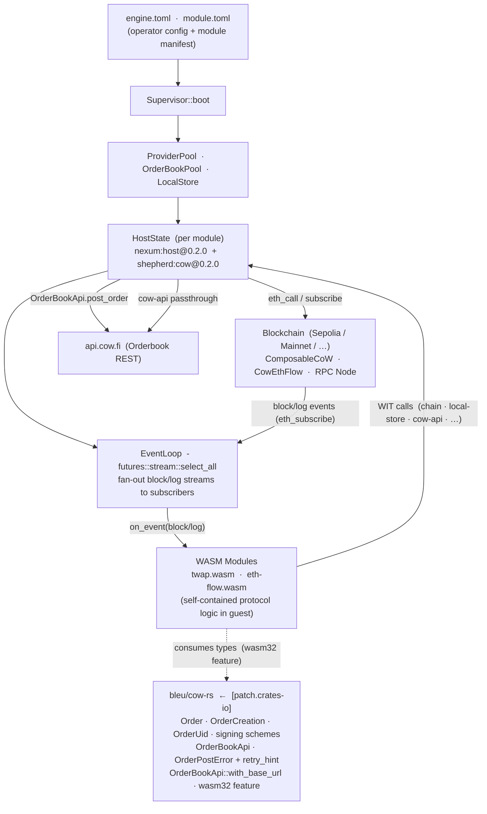
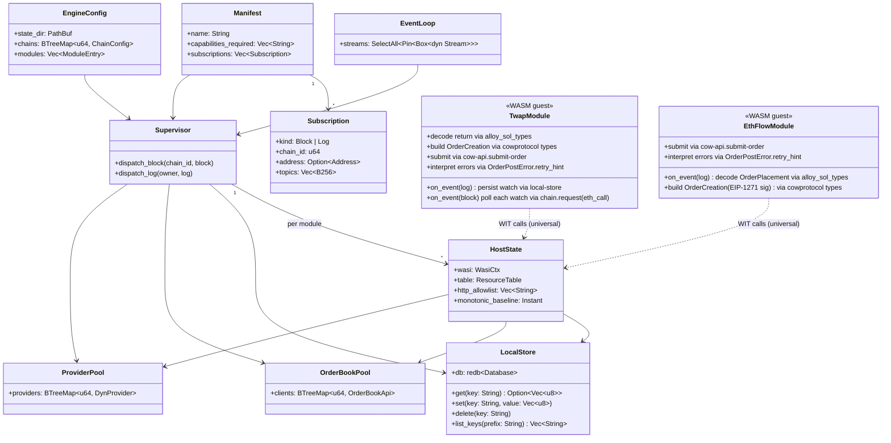
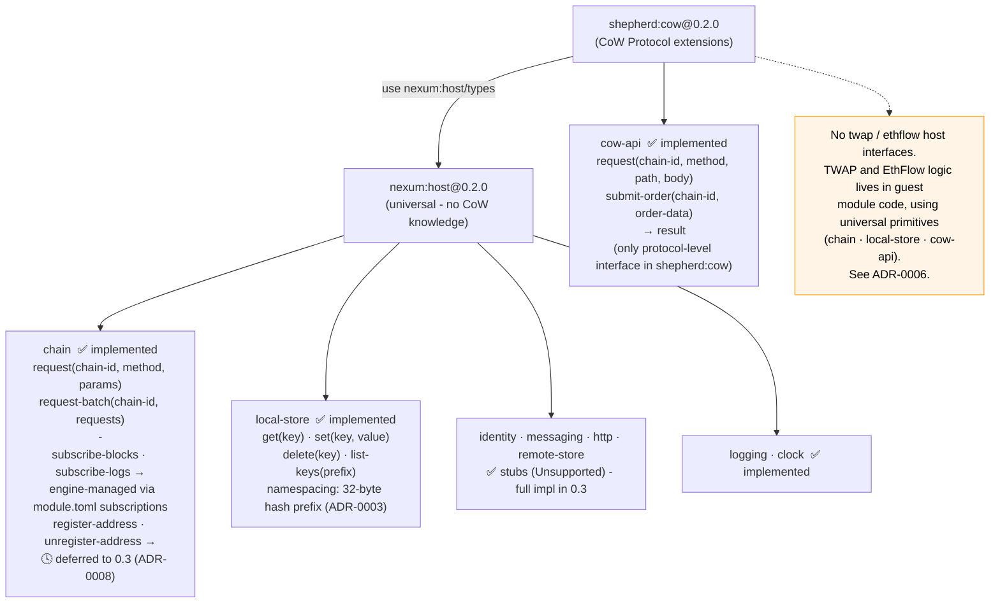
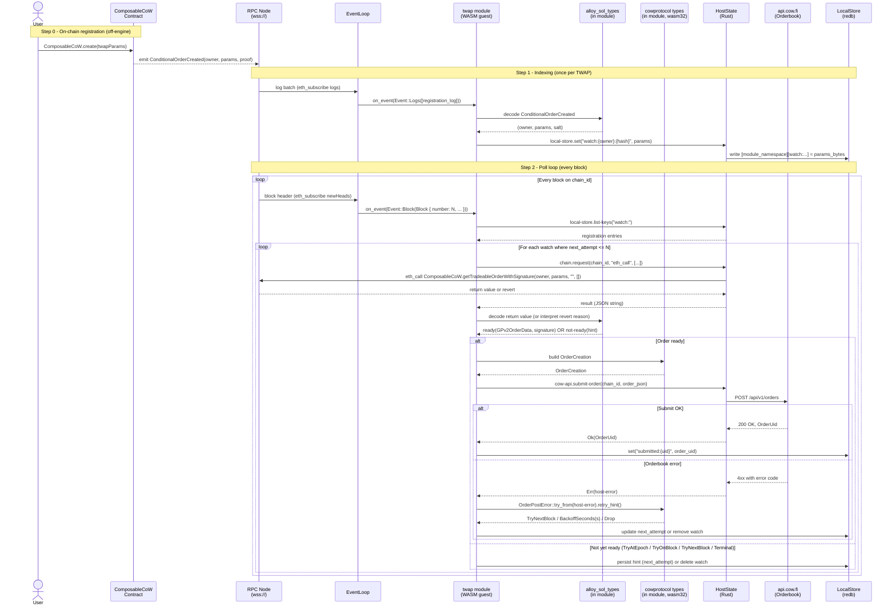
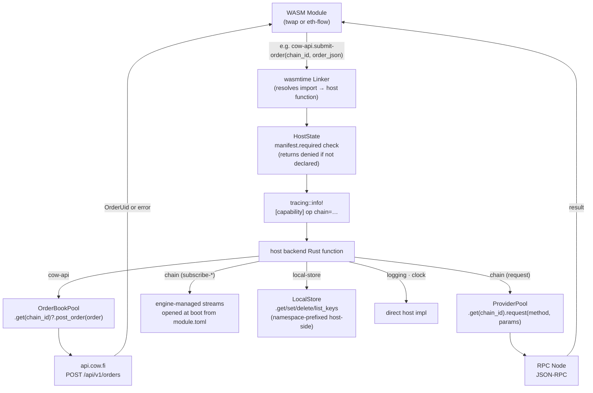
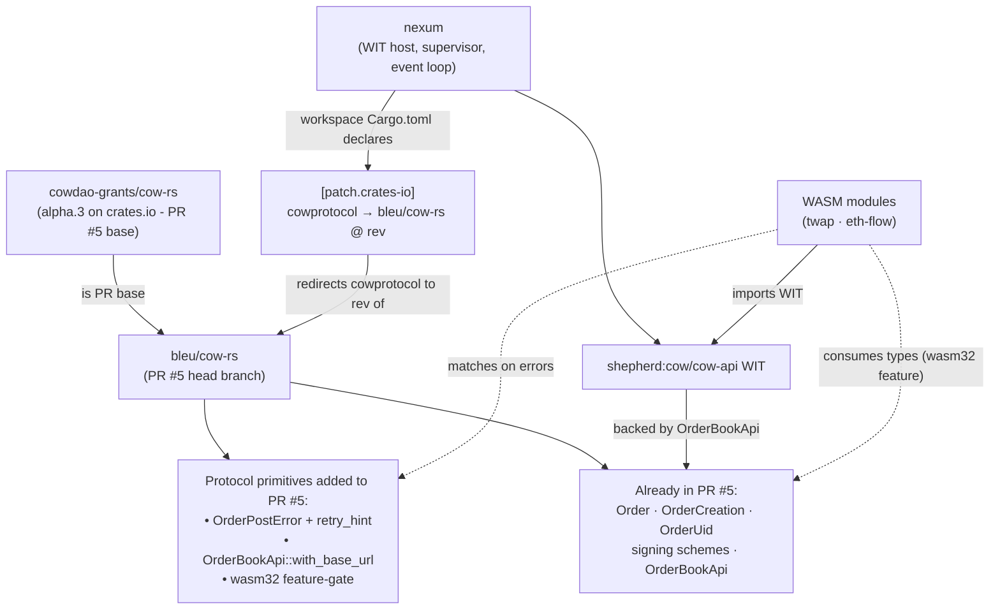

# Shepherd - Architecture Diagrams

Visual reference for the Shepherd engine, its interactions with Nexum, CoW Protocol, and the WASM module layer. Derived from ADRs 0001–0008 and the internal architecture document.

> **Scope note** - diagrams 1–4 and 7–8 reflect the **M1 implemented state** plus the **M2 target design** as described by the ADRs. Diagrams 5–6 (TWAP, EthFlow) describe **guest-module-driven flows**: the modules do all the protocol work themselves using low-level host primitives, with no specialised `twap` or `ethflow` host interfaces. Where the current code differs from the target design, a note is included in the relevant block reference.

---

## 1. System Architecture Overview

High-level component map: what lives where, how repositories depend on each other.



### Block reference

| Block | What it is |
|---|---|
| **engine.toml** | Written by the operator. Declares which chains to connect to (RPC URLs), where to store state on disk, and which WASM modules to load at boot. |
| **module.toml** | Written by the module developer and shipped inside the module bundle. Declares which capabilities the module needs (`required`), which on-chain events to subscribe to, and any module-specific config keys. Renamed from `nexum.toml` per ADR-0001 so the operator/module split is directly apparent. |
| **Supervisor::boot** | The boot orchestrator. Reads both config files, creates the shared resource pools, loads each `.wasm` component via wasmtime, and wires their subscriptions into the event streams. |
| **ProviderPool · OrderBookPool · LocalStore** | The three shared backends. `ProviderPool` holds one alloy RPC client per chain. `OrderBookPool` holds one CoW orderbook HTTP client per chain. `LocalStore` is a single redb key-value database shared by all modules (with per-module 32-byte hash namespacing - ADR-0003). |
| **HostState (per module)** | The per-module bridge between WASM guest code and Rust host code. When a module calls a WIT function (`local-store/set`, `cow-api/submit-order`, etc.), wasmtime routes that call to the corresponding method on that module's `HostState`. Capability authorisation is enforced at boot (link-time) by `manifest::enforce_capabilities`, not per call - see diagram 7 for the dispatch path. |
| **EventLoop** | The main async loop. Runs all block-header and log-event streams concurrently via `futures::stream::select_all`. When a stream fires, it routes the event to every module that subscribed to it in their `module.toml`. |
| **WASM Modules** | The guest programs. Each module exports `init(config)` (called once at boot) and `on_event(event)` (called on every relevant block or log). They contain the protocol logic themselves: TWAP polling, EthFlow event decoding, OrderCreation construction. They call back into the host through universal WIT interfaces only - no CoW-specific helper interfaces (ADR-0006). |
| **Blockchain** | The EVM chain being watched. Delivers new block headers and contract log events over a persistent WebSocket (`eth_subscribe`). Also handles `eth_call` for on-chain reads (e.g. checking whether a TWAP order is ready). |
| **bleu/cow-rs [patch.crates-io]** | The Rust crate containing CoW Protocol **primitives**: order types, signing schemes, the orderbook HTTP client, and the typed orderbook error model (`OrderPostError` + `retry_hint`). Pulled via `[patch.crates-io]` pointing at the head of upstream PR #5. Modules consume the types directly via the `wasm32` feature; the engine consumes the orderbook client via its `cow-api` host backend. No TWAP or EthFlow strategy logic lives here - that stays in module code (ADR-0007). |
| **api.cow.fi (Orderbook REST)** | The CoW Protocol orderbook service. Accepts `POST /orders` to register new orders. Trader-uploaded app-data documents are PUT to `/app_data/{hash}` separately by whoever signed the order (not by the relayer module). |

---

## 2. Domain / Class Diagram

Key types, their fields, and relationships across the engine codebase.



### Class reference

| Class | What it is |
|---|---|
| **EngineConfig** | Deserialized from `engine.toml`. Holds the database path (`state_dir`), one `ChainConfig` per chain (just an RPC URL), and the list of module paths to load. |
| **Manifest** | Deserialized from `module.toml`, which ships inside the module bundle. Declares what capabilities the module needs, which on-chain events to watch, and any module-level config values. |
| **Subscription** | One event declaration inside `module.toml`. `kind=Block` fires on every new block for a given chain. `kind=Log` fires when a specific contract emits an event matching the given address and topics. Factory-style dynamic subscriptions (`[[subscription.template]]` + `register-address`) are deferred to 0.3 - see ADR-0008. |
| **Supervisor** | Orchestrates boot and event dispatch. Creates one `HostState` per module. On each incoming block or log, calls `dispatch_block` / `dispatch_log` to fan the event out to subscribed modules. |
| **ProviderPool** | Holds one alloy `DynProvider` per chain. `wss://` chains get a pubsub provider that supports both subscriptions and requests. `https://` chains get HTTP-only (subscriptions unavailable, by design - ADR-0002). |
| **OrderBookPool** | Holds one `OrderBookApi` client per known CoW chain (Mainnet, Gnosis, Sepolia, ArbitrumOne, Base). Instantiated via `OrderBookPool::default()` at boot (ADR-0005). |
| **LocalStore** | A single redb embedded database at `state_dir`. All modules write into the same file. Keys are prefixed host-side as `[32-byte module namespace][raw_key]` so two modules never collide, and the namespace is unspoofable (ADR-0003). The namespace is `keccak256(module_name)` for locally-loaded modules and `ens_namehash(name)` for ENS-discovered modules. |
| **HostState** | The per-module runtime context. `wasmtime::component::bindgen!` generates one trait per WIT interface (e.g. `shepherd::cow::cow_api::Host`); `HostState` implements each trait. `Shepherd::add_to_linker` registers all trait implementations with the `Linker<HostState>` once at boot. **Current fields** (M1): `wasi: WasiCtx`, `table: ResourceTable`, `http_allowlist: Vec<String>`, `monotonic_baseline: Instant`. **M2 additions** will add `module_namespace: [u8; 32]`, `provider_pool: Arc<ProviderPool>`, `ob_pool: Arc<OrderBookPool>`, `local_store: Arc<LocalStore>`. |
| **EventLoop** | Runs `futures::stream::select_all` over a `Vec<Pin<Box<dyn Stream<Item = Event> + Send>>>`. The loop never exits until SIGINT/SIGTERM. Each fired event is forwarded to `Supervisor` for fan-out. |
| **TwapModule** | The TWAP watcher WASM component. On a `Log` event (ConditionalOrderCreated): persists the registration in `local-store`. On a `Block` event: iterates all watches and, for each, makes an `eth_call` via `chain.request`, decodes the result via `alloy_sol_types` (in-module), builds an `OrderCreation` via `cowprotocol` types (consumed via wasm32 feature), and submits via `cow-api.submit-order`. Orderbook errors flow through `OrderPostError::retry_hint`. All polling logic lives in the module, not the host (ADR-0006). |
| **EthFlowModule** | The EthFlow watcher WASM component. On a `Log` event (OrderPlacement): decodes the event via `alloy_sol_types` in-module, builds the `OrderCreation` with the EIP-1271 signing scheme via `cowprotocol` types, and submits via `cow-api.submit-order`. No polling loop - one log equals one submission attempt. |

---

## 3. WIT Interface Hierarchy

Two WIT packages: the universal `nexum:host` and the CoW-specific `shepherd:cow`.



### Interface reference

| Interface | What it does |
|---|---|
| **nexum:host@0.2.0** | The base WIT package. Any module running in the engine - CoW-aware or not - imports from here. Defines shared types (`chain-id`, `log`, `host-error`) used by both packages. |
| **chain** | Reads from the blockchain via JSON-RPC. `request` sends a single call; `request-batch` sends several in one round-trip. **Subscriptions are not callable WIT functions** - they are declared in `module.toml` and opened by the engine at boot. Dynamic `register-address` for factory patterns is deferred to 0.3 (ADR-0008). |
| **local-store** | Persistent key-value storage that survives restarts. Operations: `get(key)`, `set(key, value)`, `delete(key)`, `list-keys(prefix)`. The host prefixes every key with a 32-byte deterministic namespace (`keccak256(module_name)` locally, or `ens_namehash(name)` when ENS-loaded) so modules are fully isolated and the namespace cannot be spoofed (ADR-0003). |
| **identity · messaging · http · remote-store** | Capabilities stubbed at 0.2 - they return `Unsupported`. `identity` will provide keystore-backed signing. `messaging` will send Waku messages. `http` will allow direct outbound HTTP calls (subject to the manifest's allowlist). `remote-store` will read/write Swarm/IPFS. |
| **logging · clock** | Lightweight utilities. `logging` emits to the engine's `tracing` subscriber (inherits `RUST_LOG` filters). `clock` returns wall-clock time. Secure randomness is available ambiently via `wasi:random`. |
| **shepherd:cow@0.2.0** | The CoW Protocol extension package. Imports `nexum:host/types` for shared types so modules don't re-define `chain-id` or `log`. Only CoW-aware modules need to import this package. Contains exactly **one** interface in 0.2: `cow-api`. |
| **cow-api** | Generic orderbook access. `request` is a raw REST passthrough (returns JSON string). `submit-order` takes raw order bytes and returns a `result<string, host-error>` where the string is the order UID. Routes through the engine's `OrderBookPool`. This is the only protocol-level CoW interface in 0.2 - the boundary between "what CoW Protocol *is*" (orderbook submission, order types) and "what's implemented *on top* of CoW" (TWAP polling, EthFlow event handling). |
| **(no twap interface)** | Per ADR-0006, no specialised TWAP host interface exists. The TWAP module implements polling, decoding, and submission entirely in guest code, using `chain.request` for `eth_call`, `local-store` for state, `alloy_sol_types` (in-module) for ABI decoding, `cowprotocol` types for `OrderCreation`, and `cow-api.submit-order` for orderbook submission. Multiple TWAP strategies can coexist as separate modules with different polling policies and error tolerances. |
| **(no ethflow interface)** | Per ADR-0006, no specialised EthFlow host interface exists. The EthFlow module decodes `OrderPlacement` directly in guest code via `alloy_sol_types`, constructs the `OrderCreation` with the EIP-1271 signing scheme via `cowprotocol` types, and submits via `cow-api`. |

---

## 4. Engine Boot Sequence

```mermaid
flowchart TD
    Start([nexum starts]) --> ReadConfig
    ReadConfig["1. Read engine.toml\n(EngineConfig::load)"]
    ReadConfig --> InitTracing
    InitTracing["2. Init tracing\n(RUST_LOG / log_level)"]
    InitTracing --> ProvPool
    ProvPool["3. ProviderPool::from_config\nFor each chain:\n  wss:// → pubsub DynProvider\n  https:// → http DynProvider\n(fatal on connection error - ADR-0002)"]
    ProvPool --> OpenStore
    OpenStore["4. LocalStore::open(state_dir)\nOpen/create redb DB\nnexum:local-store table\n(ADR-0003)"]
    OpenStore --> OBPoolInit
    OBPoolInit["5. OrderBookPool::default()\nBuild OrderBookApi for:\nMainnet, Gnosis, Sepolia, ArbitrumOne, Base\n(ADR-0005)"]
    OBPoolInit --> SupervisorBoot
    SupervisorBoot["6. Supervisor::boot\nFor each [[modules]] in engine.toml:"]
    SupervisorBoot --> LoadManifest["  a. Load module.toml (Manifest)"]
    LoadManifest --> LoadWasm["  b. Load .wasm Component (wasmtime)"]
    LoadWasm --> Instantiate["  c. Instantiate with dedicated HostState\n     (links nexum:host + shepherd:cow impls)"]
    Instantiate --> CallInit["  d. Call module.init(config)"]
    CallInit --> AnnotateSubs["  e. Annotate subscriptions from manifest"]
    AnnotateSubs --> MoreModules{More modules?}
    MoreModules -->|yes| LoadManifest
    MoreModules -->|no| OpenStreams
    OpenStreams["7. open_block_streams + open_log_streams\neth_subscribe newHeads per chain\neth_subscribe logs per (chain, address, topics)"]
    OpenStreams --> RunLoop
    RunLoop["8. run_event_loop\nfutures::stream::select_all over all streams\nfan-out: block → all block subscribers\nlog → owner module only"]
    RunLoop --> Wait([Await SIGINT/SIGTERM])
```



### Step reference

| Step | What happens |
|---|---|
| **1. Read engine.toml** | Deserializes the operator config. If the file is missing, the engine falls back to defaults (no chains, default `state_dir`). Modules that need chains will receive `Unsupported` errors at runtime. |
| **2. Init tracing** | Sets up the `tracing` subscriber using `RUST_LOG` or the `log_level` field from `engine.toml`. All host log output flows through here, including per-capability trace events. |
| **3. ProviderPool** | Opens one alloy connection per chain declared in `[chains]`. WebSocket URLs get a full pubsub provider (the recommended setup for any chain a module subscribes to). HTTP URLs get a request-only provider. Any connection failure at this step is fatal - the engine refuses to start with a broken chain rather than silently degrading. Failover and retry are out of scope; they live in alloy middleware (ADR-0002). |
| **4. LocalStore** | Opens (or creates) the redb database at `state_dir`. Creates the `nexum:local-store` table if it doesn't exist. Per-module namespacing uses a 32-byte deterministic hash prefix. Module state from previous runs is immediately available. |
| **5. OrderBookPool** | Constructs one `OrderBookApi` HTTP client for each supported CoW chain via the `Default` implementation. Built upfront so config errors (unknown chain IDs) surface at boot, not on the first order submission. |
| **6. Supervisor::boot (per module)** | For each module listed in `engine.toml`: reads its `module.toml`, loads the `.wasm` component into wasmtime, creates a dedicated `HostState`, calls the module's `init(config)` export, and records which subscriptions the module declared. |
| **7. Open streams** | Aggregates all subscriptions declared across all modules. Opens one `eth_subscribe newHeads` per chain and one `eth_subscribe logs` per (chain, contract-address, topics) filter. |
| **8. Event loop** | The engine enters its steady-state loop. `futures::stream::select_all` waits for the next event on any stream. Block events are broadcast to all modules subscribed to that chain. Log events are delivered only to the module that owns that subscription. |

---

## 5. TWAP Complete Flow (Registration → Submit)

The TWAP module runs the entire flow in guest Rust code, using only universal host primitives.



### Participant reference

| Participant | Role in this flow |
|---|---|
| **User** | The trader. Interacts with the blockchain directly - the engine never touches private keys. |
| **ComposableCoW Contract** | The on-chain conditional order registry. Accepts TWAP parameters via `create()` and emits `ConditionalOrderCreated`. Also exposes `getTradeableOrderWithSignature()`, which the engine polls to check whether the current TWAP part is ready to trade. |
| **RPC Node** | The WebSocket connection to the chain. Delivers log events (subscriptions) and handles `eth_call` (synchronous reads). Must be `wss://` for this flow since it uses subscriptions. |
| **EventLoop** | Receives raw events from the RPC node and routes them to the module that subscribed to them. Opaque to the flow - it just calls `on_event`. |
| **twap module (WASM guest)** | Contains the entire TWAP strategy: decoding registrations, deciding when to poll (using stored hints), reacting to revert reasons, building orders, interpreting orderbook errors. Calls into the host only through universal WIT primitives. |
| **alloy_sol_types (in module)** | The ABI-aware decoder. Compiled into the module's WASM. Decodes `ConditionalOrderCreated` from raw log bytes; decodes the `getTradeableOrderWithSignature` return; interprets revert reasons. No host involvement for decoding. |
| **cowprotocol types (in module)** | The protocol-level types from `bleu/cow-rs`, consumed by the module via the wasm32 feature (ADR-0007 item 3). Used to build `OrderCreation`, manipulate `OrderUid`, and pattern-match `OrderPostError`. The crate's HTTP client (`OrderBookApi`) is **not** used directly by the module - orderbook submission goes through the host's `cow-api`. |
| **HostState (Rust)** | Provides only the universal primitives (`chain.request`, `local-store.*`, `cow-api.submit-order`). Knows nothing about TWAP semantics. |
| **api.cow.fi (Orderbook)** | Receives the signed `OrderCreation`, validates it, and returns a 56-byte `OrderUid`. The order is now visible to CoW solvers. |
| **LocalStore (redb)** | Persistent state for the TWAP module. `watch:{owner}:{hash}` entries hold registrations. `submitted:{uid}` entries record completed submissions. `next_attempt` hints (epoch or block) let the module skip polling during the gap between TWAP parts. All entries survive engine restarts. |

---

## 6. EthFlow Complete Flow (Event-Driven)

```mermaid
sequenceDiagram
    actor User
    participant EFC as CoWSwapEthFlow<br/>Contract
    participant RPC as RPC Node<br/>(wss://)
    participant EL as EventLoop
    participant EM as eth-flow module<br/>(WASM guest)
    participant SD as alloy_sol_types<br/>(in module)
    participant CR as cowprotocol types<br/>(in module, wasm32)
    participant HS as HostState<br/>(Rust)
    participant OB as api.cow.fi<br/>(Orderbook)
    participant LS as LocalStore<br/>(redb)

    Note over User,EFC: Step 0 - User creates ETH order on-chain
    User->>EFC: createOrder(order, msg.value=ETH)
    EFC->>EFC: store orders[hash] = onchainData,<br/>emit OrderPlacement(sender, order, EIP1271-sig, data)
    EFC-->>RPC: log emitted on block N

    Note over RPC,LS: Step 1 - Log arrives via subscription
    RPC->>EL: log batch matching CoWSwapEthFlow address + OrderPlacement topic
    EL->>EM: on_event(Event::Logs([placement_log]))

    Note over EM,LS: Step 2 - Decode and submit (1 log = 1 submission)
    EM->>SD: decode OrderPlacement(sender, order, sig, data)
    SD-->>EM: (sender, GPv2OrderData, EIP-1271 sig, data)

    EM->>CR: build OrderCreation with EIP-1271 scheme<br/>pointing at CoWSwapEthFlow contract
    CR-->>EM: OrderCreation + OrderUid

    EM->>HS: cow-api.submit-order(chain_id, order_json)
    HS->>OB: POST /api/v1/orders
    OB-->>HS: result

    alt 200 OK with OrderUid
        HS-->>EM: Ok(OrderUid)
        EM->>LS: set("submitted:{uid}", order_uid)
    else 4xx with error code
        HS-->>EM: Err(host-error with code)
        EM->>CR: OrderPostError::try_from(host-error).retry_hint()
        CR-->>EM: TryNextBlock / BackoffSeconds(s) / Drop

        alt TryNextBlock
            Note over EM: log and skip; next block retries
        else BackoffSeconds(s)
            EM->>LS: set("backoff:{uid}", now + s)
        else Drop
            EM->>LS: set("dropped:{uid}", reason)
        end
    end
```

### Participant reference

| Participant | Role in this flow |
|---|---|
| **User** | The trader. Deposits native ETH into the `CoWSwapEthFlow` contract and specifies swap parameters. The contract is the EIP-1271 signer on behalf of the user. |
| **CoWSwapEthFlow Contract** | Custodies the ETH, stores the order metadata on-chain, and emits `OrderPlacement` so off-chain relayers (this module, plus CoW's own internal autopilot indexer) can pick up the order. |
| **RPC Node** | Delivers the `OrderPlacement` log via the persistent WebSocket subscription. No `eth_call` is needed in this flow - the log contains everything required to reconstruct the order. |
| **EventLoop** | Routes the log to the eth-flow module based on the `[[subscription]]` entry in its `module.toml` (matching the `CoWSwapEthFlow` contract address and the `OrderPlacement` topic). |
| **eth-flow module (WASM guest)** | Contains the entire EthFlow relay logic: decoding, OrderCreation construction, submission, error handling. No polling loop; one log equals one submission attempt. |
| **alloy_sol_types (in module)** | Decodes the `OrderPlacement` event in module-side Rust. The event payload carries the typed `GPv2OrderData`, the EIP-1271 signature blob, and the extra data field. |
| **cowprotocol types (in module)** | Used to construct the `OrderCreation` with the EIP-1271 signing scheme (the signature points at the `CoWSwapEthFlow` contract address, not at the user's key) and to compute the 56-byte `OrderUid`. `OrderPostError` from the same crate is used to interpret orderbook errors. |
| **HostState (Rust)** | Provides only the `cow-api.submit-order` primitive for this flow. Maps orderbook errors to `host-error` with the original error code preserved so the module can recover the typed `OrderPostError`. |
| **api.cow.fi (Orderbook)** | Receives the order. Returns `OrderUid` on success. Returns a typed error code on failure, which the module recovers and passes through `OrderPostError::retry_hint()` to decide what to do next. App-data documents are **not** fetched here; the trader uploads them via `PUT /api/v1/app_data/{hash}` separately. |
| **LocalStore (redb)** | `submitted:{uid}` records successful submissions. `backoff:{uid}` records pending retries with a deadline. `dropped:{uid}` records permanently-failed orders. All entries survive restarts so the module does not re-submit known orders. |

---

## 7. Capability Dispatch (Generic Host Call Path)

How any WIT function call from a WASM module reaches the host backend it targets.



### Node reference

| Node | What it does |
|---|---|
| **WASM Module** | The guest program. It calls imported WIT functions exactly like regular function calls - it has no visibility into the host machinery behind them. |
| **wasmtime Linker** | `Linker<HostState>` built once at startup. `wasmtime::component::bindgen!` generates a `Shepherd` world struct and one trait per WIT interface (e.g. `shepherd::cow::cow_api::Host`, `nexum::host::local_store::Host`). `Shepherd::add_to_linker(&mut linker, \|state\| state)` registers every trait method as a host function. After that, calls from WASM resolve with zero dynamic dispatch overhead - the vtable is built at link time, not per-call. |
| **HostState - manifest.required check** | In 0.2, capability enforcement is **link-time**, not per-call. At boot, `manifest::enforce_capabilities` (in `crates/nexum-runtime/src/manifest/capabilities.rs`) cross-checks every capability-bearing WIT import of the component against the `[capabilities].required` ∪ `[capabilities].optional` set in `module.toml`, with names validated against `KNOWN_CAPABILITIES`. A module that imports a capability it did not declare fails instantiation - it never reaches dispatch. This is structurally equivalent to per-call gating for the 0.2 capability set: an undeclared capability cannot link the relevant WIT, so unauthorised calls fail at component link rather than per-call dispatch. Per-call gating in `HostState` (returning `host-error { kind: denied }` per invocation, useful for finer-grained policies or capability revocation at runtime) remains a future direction for 0.3+ if a richer threat model demands it; it is not in 0.2 scope. |
| **tracing::info!** | Every host call emits a structured trace event (capability name, chain id, etc.). Operators use `RUST_LOG=shepherd=debug` to see every call a module makes. |
| **host backend Rust function** | `HostState` implements one generated trait per WIT interface. Each `async fn` in the trait receives `&mut self` (giving access to all host resources) and returns the WIT-mapped Rust type. There are no CoW-strategy-specific backends - only the universal ones plus `cow-api` (ADR-0006). |
| **OrderBookPool** | Looks up the `OrderBookApi` client for the requested chain and calls `post_order`. Returns a 56-byte `OrderUid` on success or an `OrderPostError`-bearing host error on failure. |
| **ProviderPool (chain.request)** | Looks up the alloy provider for the requested chain and dispatches the JSON-RPC call (`eth_call`, `eth_getLogs`, etc.). |
| **engine-managed streams (chain.subscribe-*)** | Subscriptions are not exposed as runtime-callable host functions in 0.2. They are opened by the engine at boot from each module's declared `[[subscription]]` entries; events flow into the module via `on_event`. Dynamic `register-address` for factory patterns is deferred (ADR-0008). |
| **LocalStore** | Reads or writes a key in the module's namespace. The module sees plain keys; the host silently prepends a 32-byte namespace prefix. |
| **logging · clock** | Lightweight stateless helpers; implemented directly on `HostState` without a separate pool. |

---

## 8. Repository Dependency Map



### Node reference

| Node | What it is |
|---|---|
| **cowdao-grants/cow-rs** | The upstream CoW Protocol Rust SDK, maintained by the DAO. Version `alpha.3` is published to crates.io but predates 18 follow-up commits Bleu has been pushing through PR #5. This is the PR base - changes land here eventually. |
| **bleu/cow-rs** | Bleu's repository, which is simultaneously the head branch of the DAO's open PR #5. Every commit Bleu pushes here also advances PR #5 for upstream review. This is not a long-lived parallel fork - it is the active PR branch (ADR-0004). |
| **Protocol primitives added to PR #5** | The three additions Bleu is pushing into PR #5: `OrderPostError` rich variants + `retry_hint()` (critical for module error handling), `OrderBookApi::with_base_url` (barn / staging / forked deployments), and `wasm32` feature-gating (critical so guest modules can consume `cowprotocol` types). All three are protocol primitives - they describe what CoW Protocol *is*, not how a particular strategy uses it. TWAP polling and EthFlow event decoding are explicitly *not* added here; they stay in module code (ADR-0007). |
| **Already in PR #5** | The types and orderbook client Bleu's modules consume but did not add: `Order`, `OrderCreation`, `OrderUid`, signing-scheme enums, and `OrderBookApi`. These existed in PR #5 before the M2 work. |
| **[patch.crates-io]** | A single line in the workspace `Cargo.toml` that tells Cargo to use `bleu/cow-rs` at a specific git rev instead of the `alpha.3` release on crates.io. Bumping the rev is the only change needed to pick up a new primitive after it is pushed to `bleu/cow-rs` (ADR-0004). |
| **nexum** | The engine binary. Contains the WIT host implementations, Supervisor, EventLoop, config loaders, and alloy/redb integration. Contains no CoW Protocol logic - protocol primitives live in `bleu/cow-rs`; strategy logic lives in guest modules. |
| **shepherd:cow/cow-api WIT** | The only CoW-specific WIT interface in 0.2. The engine implements it (host side); WASM modules import it (guest side). Backed by `OrderBookPool` (and through that, `OrderBookApi` from `cow-rs`). |
| **WASM modules (twap · eth-flow)** | The grant deliverables. Compiled to `.wasm` Component Model binaries. Import only universal WIT interfaces (`chain`, `local-store`, `logging`) plus `shepherd:cow/cow-api`. Consume `cowprotocol` types directly through the wasm32 feature for building `OrderCreation` and pattern-matching on `OrderPostError`. Contain all TWAP and EthFlow strategy logic themselves (ADR-0006). |
